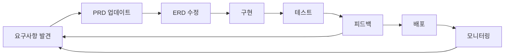

# (250907-v1.0)ITERATIVE_DEVELOPMENT.md — 반복적 개선 프로세스

## 버전 히스토리

| 버전 | 날짜 | 작성자 | 변경사항 |
|------|------|--------|----------|
| v1.0 | 2025-09-07 | 개발팀 | 최초 작성, 반복 개발 프로세스 정의 |

---

## 반복적 개선 프로세스 가이드

> **Version**: 1.0.0  
> **Created**: 2025-01-25  
> **Purpose**: 지속적인 시스템 개선을 위한 개발 프로세스 정의

## 🎯 핵심 원칙

### 1. **Test-Driven Refinement**
실제 사용 중 발견된 문제를 즉시 해결하고 문서화

### 2. **Documentation-First**
모든 변경사항은 문서에 먼저 반영 후 구현

### 3. **Incremental Enhancement**
작은 단위로 자주 개선하여 리스크 최소화

---

## 🔄 개발 사이클



## 📋 프로세스 단계별 상세

### Phase 1: Discovery (발견)
**트리거 포인트**:
- 사용자 피드백
- 테스트 중 발견된 이슈
- 비즈니스 요구사항 변경
- 성능/보안 개선 필요

**액션**:
1. 이슈/요구사항 기록
2. 우선순위 평가
3. 영향도 분석

### Phase 2: Documentation (문서화)
**업데이트 대상**:
- `PRD_v2.md` - 비즈니스 요구사항
- `DATABASE_ERD.md` - 데이터베이스 구조
- `CLAUDE.md` - AI 개발 가이드
- `CHANGELOG.md` - 변경 이력

**체크리스트**:
```markdown
- [ ] PRD에 새 요구사항 추가
- [ ] ERD 다이어그램 업데이트
- [ ] API 엔드포인트 명세 수정
- [ ] 테스트 시나리오 추가
```

### Phase 3: Implementation (구현)
**개발 순서**:
1. Database Migration
   ```sql
   -- migrations/00X_description.sql
   ALTER TABLE ... ADD COLUMN ...
   ```

2. API Route Updates
   ```typescript
   // app/api/[resource]/route.ts
   ```

3. UI Component Changes
   ```tsx
   // components/[feature]/[component].tsx
   ```

4. Integration Testing

### Phase 4: Validation (검증)
**테스트 레벨**:
- **Unit Tests**: 개별 함수/컴포넌트
- **Integration Tests**: API + DB 연동
- **E2E Tests**: 전체 사용자 플로우
- **User Acceptance**: 실제 사용 테스트

### Phase 5: Deployment (배포)
**배포 체크리스트**:
```markdown
- [ ] 마이그레이션 실행
- [ ] 환경변수 확인
- [ ] RLS 정책 적용
- [ ] 캐시 무효화
- [ ] 모니터링 설정
```

---

## 📊 현재까지의 주요 개선 사항

### v1.0 → v2.0 (2025-01-25)

#### 1. **Database Structure**
- ✅ `products.image_url` 컬럼 추가
- ✅ `shipments` 테이블 활용 개선
- ✅ `tracking_barcode`, `receipt_photo_url` 추가

#### 2. **Business Logic**
- ✅ 이중 택배 시스템 (한국 + 중국)
- ✅ 배송 정보 분리 관리
- ✅ 상품 이미지 관리

#### 3. **UI/UX**
- ✅ 송장 등록 UI 개선
- ✅ 배송비, 무게 입력 필드
- ✅ 사진 업로드 기능

---

## 🔍 현재 진행 중인 개선 사항

### High Priority
1. **orders 테이블 정리**
   - Deprecated 컬럼 제거
   - shipments 테이블 완전 이관

2. **이미지 저장 최적화**
   - Base64 → Supabase Storage 이관
   - 썸네일 자동 생성

3. **성능 최적화**
   - 인덱스 추가
   - 쿼리 최적화

### Medium Priority
1. **RLS 정책 완성**
2. **실시간 알림**
3. **대시보드 차트 추가**

### Low Priority
1. **PWA 지원**
2. **다크모드**
3. **CSV 일괄 업로드**

---

## 💡 개선 제안 템플릿

```markdown
### 제안 제목
**카테고리**: Feature/Bug/Performance/Security
**우선순위**: High/Medium/Low
**영향 범위**: Database/API/UI/All

### 현재 상황
- 문제점 또는 개선 필요 사항

### 제안 내용
- 구체적인 해결 방안

### 예상 효과
- 개선 후 기대 효과

### 구현 계획
1. Step 1
2. Step 2
3. Step 3

### 테스트 방법
- 검증 시나리오
```

---

## 📝 커밋 메시지 컨벤션

```
<type>(<scope>): <subject>

<body>

<footer>
```

**Types**:
- `feat`: 새로운 기능
- `fix`: 버그 수정
- `docs`: 문서 수정
- `style`: 코드 포맷팅
- `refactor`: 리팩토링
- `perf`: 성능 개선
- `test`: 테스트 추가
- `chore`: 빌드, 설정 변경

**Examples**:
```
feat(shipments): Add barcode field support
fix(orders): Correct shipment data mapping
docs(PRD): Update v2.0 requirements
```

---

## 🚀 Quick Start for New Features

### 1. Create Migration
```bash
# Create new migration file
touch supabase/migrations/00X_feature_name.sql
```

### 2. Update Documentation
```bash
# Update ERD
vi docs/DATABASE_ERD.md

# Update PRD
vi docs/PRD_v2.md
```

### 3. Implement Feature
```bash
# API Route
vi app/api/[feature]/route.ts

# Component
vi components/[feature]/[component].tsx
```

### 4. Test & Deploy
```bash
# Run tests
npm test

# Deploy to staging
vercel --env preview

# Deploy to production
vercel --prod
```

---

## 📅 Release Schedule

| Version | Date | Major Changes |
|---------|------|---------------|
| v1.0.0 | 2025-01-20 | Initial release |
| v2.0.0 | 2025-01-25 | Dual shipping, Images |
| v2.1.0 | 2025-02-01 | Performance optimization |
| v2.2.0 | 2025-02-15 | RLS completion |
| v3.0.0 | 2025-03-01 | PWA support |

---

## 🔗 관련 문서

- [PRD_v2.md](./PRD_v2.md) - 제품 요구사항 문서
- [DATABASE_ERD.md](./DATABASE_ERD.md) - 데이터베이스 ERD
- [CLAUDE.md](../CLAUDE.md) - AI 개발 가이드
- [CHANGELOG.md](./CHANGELOG.md) - 변경 이력

---

**Note**: 이 프로세스는 지속적으로 개선됩니다. 더 나은 방법을 발견하면 즉시 이 문서를 업데이트하세요.