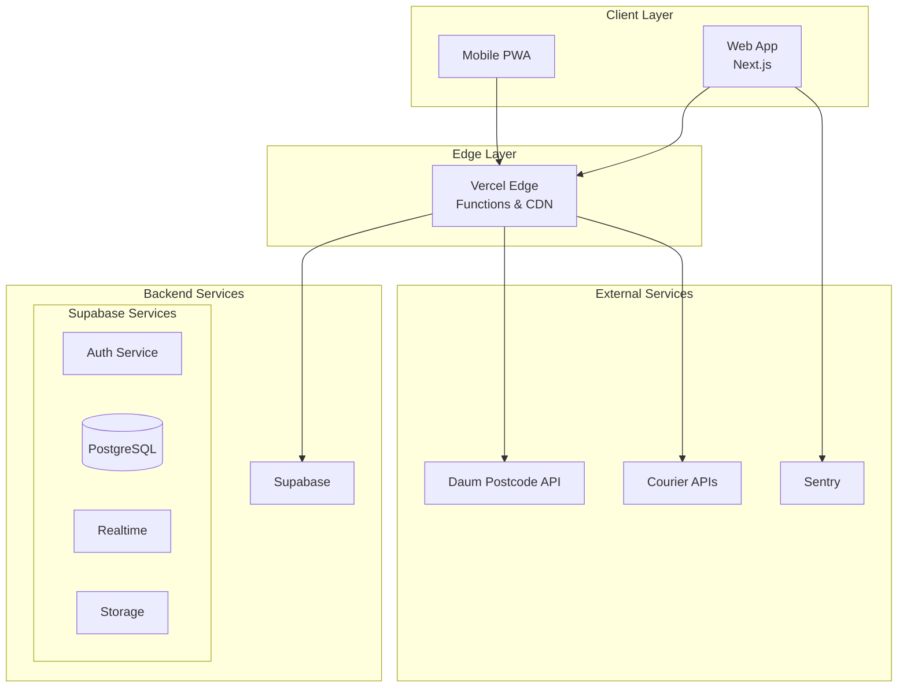
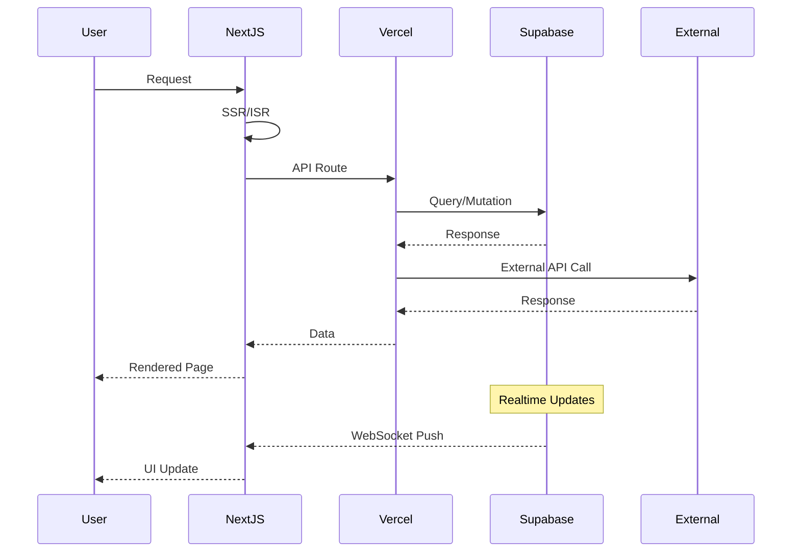

# 시스템 아키텍처 설계서 - YUANDI 초미니 ERP

## 1. 시스템 개요

### 1.1 프로젝트 목표
1인 해외구매대행업자를 위한 경량화된 주문/재고/배송 관리 시스템 구축

### 1.2 핵심 설계 원칙
- **Serverless First**: 관리 부담 최소화를 위한 서버리스 아키텍처
- **Real-time Updates**: Supabase Realtime을 활용한 실시간 데이터 동기화
- **Mobile Responsive**: 모바일 환경에서도 완벽한 사용성 보장
- **Cost Optimized**: 최소 비용으로 최대 효율 달성
- **Developer Friendly**: 빠른 개발과 유지보수를 위한 현대적 스택

## 2. 기술 스택

### 2.1 Frontend
```
├── Framework: Next.js 14 (App Router)
├── Language: TypeScript 5.x
├── Styling: Tailwind CSS 3.x
├── UI Components: shadcn/ui
├── State Management: Zustand
├── Data Fetching: TanStack Query
├── Forms: React Hook Form + Zod
├── i18n: next-intl
└── Charts: Recharts
```

### 2.2 Backend
```
├── Database: Supabase (PostgreSQL)
├── Auth: Supabase Auth
├── Realtime: Supabase Realtime
├── Storage: Supabase Storage
├── API: Next.js API Routes
├── Edge Functions: Vercel Edge Functions
└── Cron Jobs: Vercel Cron Jobs
```

### 2.3 Infrastructure
```
├── Hosting: Vercel
├── CDN: Vercel Edge Network
├── Monitoring: Vercel Analytics
├── Error Tracking: Sentry
└── CI/CD: GitHub Actions
```

## 3. 시스템 아키텍처

### 3.1 High-Level Architecture



### 3.2 Data Flow Architecture



## 4. 상세 컴포넌트 설계

### 4.1 Frontend Architecture

```
app/
├── (auth)/                    # 인증 관련 페이지
│   ├── login/
│   └── layout.tsx
├── (dashboard)/               # 대시보드 (인증 필요)
│   ├── layout.tsx            # 공통 레이아웃
│   ├── page.tsx              # 대시보드 메인
│   ├── orders/               # 주문 관리
│   │   ├── page.tsx
│   │   ├── new/
│   │   └── [id]/
│   ├── inventory/            # 재고 관리
│   │   ├── page.tsx
│   │   └── inbound/
│   ├── shipping/             # 배송 관리
│   │   └── page.tsx
│   ├── cashbook/             # 출납장부
│   │   └── page.tsx
│   ├── activity/             # 작업 로그
│   │   └── page.tsx
│   └── users/                # 사용자 관리 (Admin)
│       └── page.tsx
├── track/                     # 고객 조회 (공개)
│   └── page.tsx
├── api/                       # API Routes
│   ├── auth/
│   ├── orders/
│   ├── products/
│   ├── inventory/
│   ├── shipping/
│   ├── cashbook/
│   ├── dashboard/
│   ├── activity-logs/
│   ├── export/
│   └── track/
├── components/                # 재사용 컴포넌트
│   ├── ui/                   # shadcn/ui
│   ├── forms/                # 폼 컴포넌트
│   ├── tables/               # 테이블 컴포넌트
│   ├── charts/               # 차트 컴포넌트
│   └── layout/               # 레이아웃 컴포넌트
├── lib/                       # 유틸리티
│   ├── supabase/             # Supabase 클라이언트
│   ├── api/                  # API 함수
│   ├── hooks/                # Custom Hooks
│   ├── utils/                # 유틸리티 함수
│   └── validators/           # Zod 스키마
├── stores/                    # Zustand 스토어
│   ├── auth.store.ts
│   ├── order.store.ts
│   └── ui.store.ts
├── types/                     # TypeScript 타입
│   ├── database.types.ts     # Supabase 생성 타입
│   ├── api.types.ts
│   └── ui.types.ts
└── messages/                  # i18n 메시지
    ├── ko/
    └── zh-CN/
```

### 4.2 Database Schema Design

```sql
-- Enable RLS
ALTER DATABASE postgres SET "app.jwt_secret" TO 'your-jwt-secret';

-- Users table (Supabase Auth 기본 제공)
-- auth.users

-- Custom user profiles
CREATE TABLE profiles (
    id UUID PRIMARY KEY REFERENCES auth.users(id),
    name VARCHAR(100) NOT NULL,
    role user_role NOT NULL DEFAULT 'OrderManager',
    locale locale_type NOT NULL DEFAULT 'ko',
    active BOOLEAN DEFAULT true,
    created_at TIMESTAMPTZ DEFAULT NOW(),
    updated_at TIMESTAMPTZ DEFAULT NOW()
);

-- Enum types
CREATE TYPE user_role AS ENUM ('Admin', 'OrderManager', 'ShipManager');
CREATE TYPE locale_type AS ENUM ('ko', 'zh-CN');
CREATE TYPE order_status AS ENUM ('PAID', 'SHIPPED', 'DONE', 'REFUNDED');
CREATE TYPE cashbook_type AS ENUM ('sale', 'inbound', 'shipping', 'adjustment', 'refund');
CREATE TYPE currency_type AS ENUM ('CNY', 'KRW');

-- Products
CREATE TABLE products (
    id UUID PRIMARY KEY DEFAULT gen_random_uuid(),
    sku VARCHAR(100) UNIQUE NOT NULL,
    category VARCHAR(50) NOT NULL,
    name VARCHAR(200) NOT NULL,
    model VARCHAR(100),
    color VARCHAR(50),
    brand VARCHAR(100),
    cost_cny DECIMAL(10,2) NOT NULL,
    on_hand INTEGER DEFAULT 0 CHECK (on_hand >= 0),
    low_stock_threshold INTEGER DEFAULT 5,
    active BOOLEAN DEFAULT true,
    created_at TIMESTAMPTZ DEFAULT NOW(),
    updated_at TIMESTAMPTZ DEFAULT NOW(),
    created_by UUID REFERENCES profiles(id)
);

-- Create index for SKU generation
CREATE INDEX idx_products_category_model_color_brand 
ON products(category, model, color, brand);

-- Orders
CREATE TABLE orders (
    id UUID PRIMARY KEY DEFAULT gen_random_uuid(),
    order_no VARCHAR(20) UNIQUE NOT NULL,
    customer_name VARCHAR(100) NOT NULL,
    customer_phone VARCHAR(20) NOT NULL,
    pccc_code VARCHAR(20) NOT NULL,
    shipping_address TEXT NOT NULL,
    zip_code VARCHAR(10) NOT NULL,
    memo TEXT,
    status order_status NOT NULL DEFAULT 'PAID',
    total_amount DECIMAL(12,2) NOT NULL,
    created_at TIMESTAMPTZ DEFAULT NOW(),
    updated_at TIMESTAMPTZ DEFAULT NOW(),
    created_by UUID REFERENCES profiles(id)
);

-- Create index for order number generation
CREATE INDEX idx_orders_created_at ON orders(created_at);
CREATE INDEX idx_orders_status ON orders(status);
CREATE INDEX idx_orders_customer ON orders(customer_name, customer_phone);

-- Order Items
CREATE TABLE order_items (
    id UUID PRIMARY KEY DEFAULT gen_random_uuid(),
    order_id UUID NOT NULL REFERENCES orders(id) ON DELETE CASCADE,
    product_id UUID NOT NULL REFERENCES products(id),
    sku VARCHAR(100) NOT NULL,
    product_name VARCHAR(200) NOT NULL,
    quantity INTEGER NOT NULL CHECK (quantity > 0),
    unit_price DECIMAL(10,2) NOT NULL,
    subtotal DECIMAL(10,2) NOT NULL,
    created_at TIMESTAMPTZ DEFAULT NOW()
);

-- Shipments
CREATE TABLE shipments (
    id UUID PRIMARY KEY DEFAULT gen_random_uuid(),
    order_id UUID UNIQUE NOT NULL REFERENCES orders(id),
    courier VARCHAR(50) NOT NULL,
    tracking_no VARCHAR(50) NOT NULL,
    tracking_url VARCHAR(500),
    shipment_photo_url VARCHAR(500),
    shipped_at TIMESTAMPTZ DEFAULT NOW(),
    created_by UUID REFERENCES profiles(id)
);

-- Event Logs
CREATE TABLE event_logs (
    id UUID PRIMARY KEY DEFAULT gen_random_uuid(),
    actor_id UUID REFERENCES profiles(id),
    actor_name VARCHAR(100),
    event_type VARCHAR(50) NOT NULL,
    ref_type VARCHAR(50),
    ref_id UUID,
    ref_name VARCHAR(200),
    before_data JSONB,
    after_data JSONB,
    ip_address INET,
    user_agent TEXT,
    created_at TIMESTAMPTZ DEFAULT NOW()
);

-- Create indexes for event logs
CREATE INDEX idx_event_logs_actor ON event_logs(actor_id);
CREATE INDEX idx_event_logs_ref ON event_logs(ref_type, ref_id);
CREATE INDEX idx_event_logs_created_at ON event_logs(created_at DESC);

-- Cashbook
CREATE TABLE cashbook (
    id UUID PRIMARY KEY DEFAULT gen_random_uuid(),
    date DATE NOT NULL DEFAULT CURRENT_DATE,
    type cashbook_type NOT NULL,
    amount DECIMAL(12,2) NOT NULL,
    currency currency_type NOT NULL DEFAULT 'KRW',
    fx_rate DECIMAL(10,4) DEFAULT 1,
    amount_krw DECIMAL(12,2) NOT NULL,
    ref_type VARCHAR(50),
    ref_id UUID,
    note TEXT,
    created_at TIMESTAMPTZ DEFAULT NOW(),
    created_by UUID REFERENCES profiles(id)
);

-- Create indexes for cashbook
CREATE INDEX idx_cashbook_date ON cashbook(date DESC);
CREATE INDEX idx_cashbook_type ON cashbook(type);

-- Inventory Movements (for tracking)
CREATE TABLE inventory_movements (
    id UUID PRIMARY KEY DEFAULT gen_random_uuid(),
    product_id UUID NOT NULL REFERENCES products(id),
    movement_type VARCHAR(20) NOT NULL, -- 'inbound', 'sale', 'adjustment'
    quantity INTEGER NOT NULL, -- positive for inbound, negative for outbound
    balance_after INTEGER NOT NULL,
    ref_type VARCHAR(50),
    ref_id UUID,
    note TEXT,
    created_at TIMESTAMPTZ DEFAULT NOW(),
    created_by UUID REFERENCES profiles(id)
);

-- Functions for automatic operations

-- Function to generate order number
CREATE OR REPLACE FUNCTION generate_order_number()
RETURNS TEXT AS $$
DECLARE
    today_date TEXT;
    seq_num INTEGER;
    new_order_no TEXT;
BEGIN
    -- Get today's date in YYMMDD format (KST)
    today_date := TO_CHAR(NOW() AT TIME ZONE 'Asia/Seoul', 'YYMMDD');
    
    -- Get the next sequence number for today
    SELECT COUNT(*) + 1 INTO seq_num
    FROM orders
    WHERE created_at::date = (NOW() AT TIME ZONE 'Asia/Seoul')::date;
    
    -- Generate order number
    new_order_no := 'ORD-' || today_date || '-' || LPAD(seq_num::TEXT, 3, '0');
    
    RETURN new_order_no;
END;
$$ LANGUAGE plpgsql;

-- Function to generate SKU
CREATE OR REPLACE FUNCTION generate_sku(
    p_category VARCHAR,
    p_model VARCHAR,
    p_color VARCHAR,
    p_brand VARCHAR
)
RETURNS TEXT AS $$
DECLARE
    hash_value TEXT;
    new_sku TEXT;
BEGIN
    -- Generate hash from concatenated values
    hash_value := UPPER(SUBSTRING(MD5(CONCAT(p_category, p_model, p_color, p_brand, NOW()::TEXT)), 1, 5));
    
    -- Build SKU
    new_sku := p_category || '-' || p_model || '-' || p_color || '-' || p_brand || '-' || hash_value;
    
    RETURN new_sku;
END;
$$ LANGUAGE plpgsql;

-- Triggers

-- Auto-generate order number
CREATE OR REPLACE FUNCTION before_order_insert()
RETURNS TRIGGER AS $$
BEGIN
    IF NEW.order_no IS NULL THEN
        NEW.order_no := generate_order_number();
    END IF;
    RETURN NEW;
END;
$$ LANGUAGE plpgsql;

CREATE TRIGGER trigger_order_number
BEFORE INSERT ON orders
FOR EACH ROW
EXECUTE FUNCTION before_order_insert();

-- Auto-generate SKU
CREATE OR REPLACE FUNCTION before_product_insert()
RETURNS TRIGGER AS $$
BEGIN
    IF NEW.sku IS NULL THEN
        NEW.sku := generate_sku(NEW.category, NEW.model, NEW.color, NEW.brand);
    END IF;
    RETURN NEW;
END;
$$ LANGUAGE plpgsql;

CREATE TRIGGER trigger_product_sku
BEFORE INSERT ON products
FOR EACH ROW
EXECUTE FUNCTION before_product_insert();

-- Update timestamps
CREATE OR REPLACE FUNCTION update_updated_at()
RETURNS TRIGGER AS $$
BEGIN
    NEW.updated_at = NOW();
    RETURN NEW;
END;
$$ LANGUAGE plpgsql;

CREATE TRIGGER update_products_updated_at BEFORE UPDATE ON products
FOR EACH ROW EXECUTE FUNCTION update_updated_at();

CREATE TRIGGER update_orders_updated_at BEFORE UPDATE ON orders
FOR EACH ROW EXECUTE FUNCTION update_updated_at();

CREATE TRIGGER update_profiles_updated_at BEFORE UPDATE ON profiles
FOR EACH ROW EXECUTE FUNCTION update_updated_at();

-- Row Level Security (RLS)

ALTER TABLE profiles ENABLE ROW LEVEL SECURITY;
ALTER TABLE products ENABLE ROW LEVEL SECURITY;
ALTER TABLE orders ENABLE ROW LEVEL SECURITY;
ALTER TABLE order_items ENABLE ROW LEVEL SECURITY;
ALTER TABLE shipments ENABLE ROW LEVEL SECURITY;
ALTER TABLE event_logs ENABLE ROW LEVEL SECURITY;
ALTER TABLE cashbook ENABLE ROW LEVEL SECURITY;
ALTER TABLE inventory_movements ENABLE ROW LEVEL SECURITY;

-- RLS Policies (simplified examples)

-- Profiles: Users can read their own profile, Admin can read all
CREATE POLICY profiles_select ON profiles
FOR SELECT USING (
    auth.uid() = id OR 
    EXISTS (SELECT 1 FROM profiles WHERE id = auth.uid() AND role = 'Admin')
);

-- Products: All authenticated users can read
CREATE POLICY products_select ON products
FOR SELECT USING (auth.uid() IS NOT NULL);

-- Products: Admin and OrderManager can insert/update
CREATE POLICY products_insert ON products
FOR INSERT WITH CHECK (
    EXISTS (SELECT 1 FROM profiles WHERE id = auth.uid() AND role IN ('Admin', 'OrderManager'))
);

-- Orders: Role-based access
CREATE POLICY orders_select ON orders
FOR SELECT USING (
    EXISTS (SELECT 1 FROM profiles WHERE id = auth.uid())
);

-- Add more RLS policies as needed...
```

### 4.3 API Design Pattern

```typescript
// API Route Structure (app/api/orders/route.ts)
import { NextRequest, NextResponse } from 'next/server';
import { createRouteHandlerClient } from '@supabase/auth-helpers-nextjs';
import { cookies } from 'next/headers';
import { z } from 'zod';

// Request validation schema
const CreateOrderSchema = z.object({
  customerName: z.string().min(1),
  customerPhone: z.string().regex(/^01[0-9]{8,9}$/),
  pcccCode: z.string().regex(/^P[0-9]{12}$/),
  shippingAddress: z.string().min(1),
  zipCode: z.string().length(5),
  items: z.array(z.object({
    productId: z.string().uuid(),
    quantity: z.number().positive()
  })).min(1)
});

// GET handler
export async function GET(request: NextRequest) {
  const supabase = createRouteHandlerClient({ cookies });
  
  // Check authentication
  const { data: { user } } = await supabase.auth.getUser();
  if (!user) {
    return NextResponse.json({ error: 'Unauthorized' }, { status: 401 });
  }
  
  // Get query parameters
  const searchParams = request.nextUrl.searchParams;
  const status = searchParams.get('status');
  const page = parseInt(searchParams.get('page') || '1');
  const limit = parseInt(searchParams.get('limit') || '10');
  
  // Build query
  let query = supabase
    .from('orders')
    .select('*, order_items(*), shipments(*)')
    .order('created_at', { ascending: false })
    .range((page - 1) * limit, page * limit - 1);
  
  if (status) {
    query = query.eq('status', status);
  }
  
  const { data, error } = await query;
  
  if (error) {
    return NextResponse.json({ error: error.message }, { status: 500 });
  }
  
  return NextResponse.json({ data, page, limit });
}

// POST handler
export async function POST(request: NextRequest) {
  const supabase = createRouteHandlerClient({ cookies });
  
  // Check authentication and role
  const { data: { user } } = await supabase.auth.getUser();
  if (!user) {
    return NextResponse.json({ error: 'Unauthorized' }, { status: 401 });
  }
  
  const { data: profile } = await supabase
    .from('profiles')
    .select('role')
    .eq('id', user.id)
    .single();
  
  if (!profile || !['Admin', 'OrderManager'].includes(profile.role)) {
    return NextResponse.json({ error: 'Forbidden' }, { status: 403 });
  }
  
  // Validate request body
  const body = await request.json();
  const validation = CreateOrderSchema.safeParse(body);
  
  if (!validation.success) {
    return NextResponse.json({ 
      error: 'Validation failed', 
      details: validation.error.flatten() 
    }, { status: 400 });
  }
  
  const orderData = validation.data;
  
  // Start transaction
  const { data: order, error } = await supabase.rpc('create_order_with_items', {
    order_data: orderData
  });
  
  if (error) {
    return NextResponse.json({ error: error.message }, { status: 500 });
  }
  
  return NextResponse.json({ data: order }, { status: 201 });
}
```

## 5. 보안 설계

### 5.1 Authentication & Authorization

```typescript
// middleware.ts
import { createMiddlewareClient } from '@supabase/auth-helpers-nextjs';
import { NextResponse } from 'next/server';
import type { NextRequest } from 'next/server';

export async function middleware(req: NextRequest) {
  const res = NextResponse.next();
  const supabase = createMiddlewareClient({ req, res });
  
  const { data: { session } } = await supabase.auth.getSession();
  
  // Public routes
  const publicRoutes = ['/track', '/api/track'];
  const isPublicRoute = publicRoutes.some(route => 
    req.nextUrl.pathname.startsWith(route)
  );
  
  if (isPublicRoute) {
    return res;
  }
  
  // Protected routes
  if (!session) {
    return NextResponse.redirect(new URL('/login', req.url));
  }
  
  // Role-based access control
  const { data: profile } = await supabase
    .from('profiles')
    .select('role')
    .eq('id', session.user.id)
    .single();
  
  // Admin-only routes
  const adminRoutes = ['/users', '/api/users'];
  const isAdminRoute = adminRoutes.some(route => 
    req.nextUrl.pathname.startsWith(route)
  );
  
  if (isAdminRoute && profile?.role !== 'Admin') {
    return NextResponse.redirect(new URL('/dashboard', req.url));
  }
  
  return res;
}

export const config = {
  matcher: ['/((?!_next/static|_next/image|favicon.ico).*)']
};
```

### 5.2 Security Headers

```typescript
// next.config.js
const securityHeaders = [
  {
    key: 'X-DNS-Prefetch-Control',
    value: 'on'
  },
  {
    key: 'Strict-Transport-Security',
    value: 'max-age=63072000; includeSubDomains; preload'
  },
  {
    key: 'X-XSS-Protection',
    value: '1; mode=block'
  },
  {
    key: 'X-Frame-Options',
    value: 'SAMEORIGIN'
  },
  {
    key: 'X-Content-Type-Options',
    value: 'nosniff'
  },
  {
    key: 'Referrer-Policy',
    value: 'origin-when-cross-origin'
  },
  {
    key: 'Content-Security-Policy',
    value: ContentSecurityPolicy.replace(/\s{2,}/g, ' ').trim()
  }
];
```

## 6. Performance Optimization

### 6.1 Caching Strategy

```typescript
// Cache configuration
export const cacheConfig = {
  // Static data caching
  products: {
    ttl: 60 * 5, // 5 minutes
    tags: ['products']
  },
  
  // Dynamic data caching
  dashboard: {
    ttl: 60, // 1 minute
    tags: ['dashboard']
  },
  
  // User-specific caching
  userOrders: {
    ttl: 30, // 30 seconds
    tags: ['orders']
  }
};

// Revalidation on mutation
export async function revalidateCache(tags: string[]) {
  // Using Next.js 14 revalidateTag
  tags.forEach(tag => revalidateTag(tag));
}
```

### 6.2 Database Optimization

```sql
-- Indexes for performance
CREATE INDEX idx_orders_date_range ON orders(created_at, status);
CREATE INDEX idx_products_search ON products(name, model, brand);
CREATE INDEX idx_cashbook_summary ON cashbook(date, type, amount_krw);

-- Materialized views for dashboard
CREATE MATERIALIZED VIEW dashboard_summary AS
SELECT 
    DATE(created_at) as date,
    COUNT(*) as order_count,
    SUM(total_amount) as total_sales,
    COUNT(DISTINCT customer_phone) as unique_customers
FROM orders
WHERE status != 'REFUNDED'
GROUP BY DATE(created_at);

-- Refresh materialized view (via cron job)
REFRESH MATERIALIZED VIEW CONCURRENTLY dashboard_summary;
```

## 7. Deployment Architecture

### 7.1 CI/CD Pipeline

```yaml
# .github/workflows/deploy.yml
name: Deploy to Production

on:
  push:
    branches: [main]

jobs:
  test:
    runs-on: ubuntu-latest
    steps:
      - uses: actions/checkout@v3
      - uses: actions/setup-node@v3
        with:
          node-version: '18'
      - run: npm ci
      - run: npm run test
      - run: npm run build

  deploy:
    needs: test
    runs-on: ubuntu-latest
    steps:
      - uses: actions/checkout@v3
      - uses: vercel/action@v1
        with:
          vercel-token: ${{ secrets.VERCEL_TOKEN }}
          vercel-org-id: ${{ secrets.VERCEL_ORG_ID }}
          vercel-project-id: ${{ secrets.VERCEL_PROJECT_ID }}
          vercel-args: '--prod'
```

### 7.2 Environment Configuration

```bash
# .env.local
NEXT_PUBLIC_SUPABASE_URL=https://xxx.supabase.co
NEXT_PUBLIC_SUPABASE_ANON_KEY=xxx
SUPABASE_SERVICE_KEY=xxx
NEXT_PUBLIC_SITE_URL=https://yuandi.vercel.app
SENTRY_DSN=xxx
DAUM_POSTCODE_KEY=xxx
```

## 8. Monitoring & Observability

### 8.1 Error Tracking

```typescript
// lib/monitoring/sentry.ts
import * as Sentry from '@sentry/nextjs';

Sentry.init({
  dsn: process.env.SENTRY_DSN,
  environment: process.env.NODE_ENV,
  tracesSampleRate: 0.1,
  beforeSend(event) {
    // Filter sensitive data
    if (event.request) {
      delete event.request.cookies;
      delete event.request.headers;
    }
    return event;
  }
});
```

### 8.2 Performance Monitoring

```typescript
// lib/monitoring/analytics.ts
import { Analytics } from '@vercel/analytics/react';
import { SpeedInsights } from '@vercel/speed-insights/next';

export function AnalyticsProvider({ children }) {
  return (
    <>
      {children}
      <Analytics />
      <SpeedInsights />
    </>
  );
}
```

## 9. Scalability Considerations

### 9.1 Horizontal Scaling
- **Vercel**: Automatic scaling with Edge Functions
- **Supabase**: Automatic connection pooling and read replicas
- **CDN**: Global edge caching for static assets

### 9.2 Performance Targets
- **Response Time**: < 3s (P99)
- **Concurrent Users**: 10-50
- **Database Size**: 10,000 orders, 1,000 products
- **Storage**: 10GB for shipment photos

## 10. Disaster Recovery

### 10.1 Backup Strategy
- **Database**: Daily automated backups (Supabase)
- **Code**: Git repository (GitHub)
- **Environment**: Infrastructure as Code

### 10.2 Recovery Procedures
- **RTO**: 4 hours
- **RPO**: 24 hours
- **Backup Testing**: Monthly validation

## 11. Future Considerations

### 11.1 Phase 2 Enhancements
- SMS/Email notifications (Twilio/SendGrid)
- Customer tier management
- Mobile app (React Native)
- Advanced analytics dashboard

### 11.2 Technical Debt Management
- Regular dependency updates
- Performance optimization reviews
- Security audit quarterly
- Code refactoring sprints

## 12. Development Guidelines

### 12.1 Code Standards
- ESLint + Prettier configuration
- TypeScript strict mode
- Conventional commits
- PR review requirements

### 12.2 Testing Strategy
- Unit tests: Vitest
- Integration tests: Supertest
- E2E tests: Playwright
- Coverage target: 80%

---

**문서 버전**: 1.0.0
**작성일**: 2024-12-28
**작성자**: YUANDI System Architect