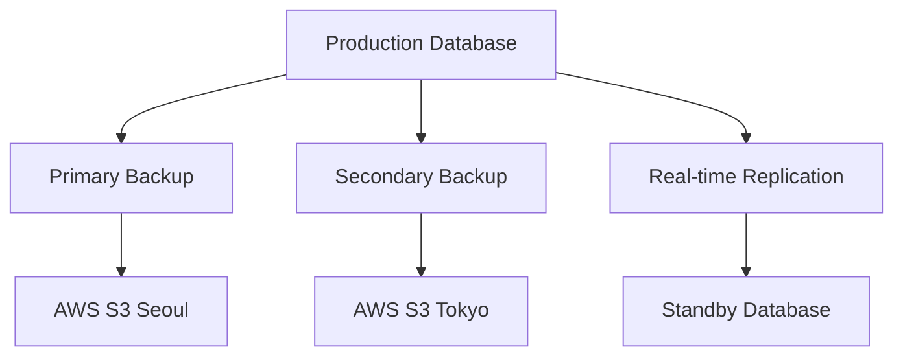

# YUANDI ERP - 백업 및 복구 전략

## 📋 목차
1. [백업 아키텍처](#백업-아키텍처)
2. [백업 구현](#백업-구현)
3. [복구 절차](#복구-절차)
4. [재해 복구 계획](#재해-복구-계획)
5. [테스트 및 검증](#테스트-및-검증)

---

## 🏗️ 백업 아키텍처

### 3-2-1 백업 전략
- **3개의 백업 복사본** 유지
- **2개의 서로 다른 미디어** 사용
- **1개의 오프사이트 백업** 보관

### 백업 구성 요소



### 백업 레벨 및 주기

| 백업 유형 | 주기 | 보관 기간 | 저장 위치 | 자동화 |
|----------|------|-----------|----------|--------|
| 전체 백업 | 일간 | 30일 | S3 + 로컬 | ✅ |
| 증분 백업 | 6시간 | 7일 | Supabase | ✅ |
| 트랜잭션 로그 | 실시간 | 14일 | WAL Archive | ✅ |
| 스냅샷 | 주간 | 90일 | Cross-region | ✅ |
| 아카이브 | 월간 | 1년 | Glacier | ✅ |

---

## 💾 백업 구현

### 1. 자동 백업 스크립트

```bash
#!/bin/bash
# scripts/backup/automated-backup.sh

set -e

# 환경 변수 로드
source /etc/yuandi/backup.env

# 변수 설정
DATE=$(date +%Y%m%d_%H%M%S)
BACKUP_ROOT="/backup"
BACKUP_DIR="$BACKUP_ROOT/$DATE"
LOG_FILE="$BACKUP_ROOT/logs/backup_$DATE.log"

# 함수 정의
log() {
    echo "[$(date +'%Y-%m-%d %H:%M:%S')] $1" | tee -a "$LOG_FILE"
}

notify() {
    # Slack 또는 이메일 알림
    curl -X POST $SLACK_WEBHOOK -d "{\"text\": \"$1\"}"
}

# 백업 디렉토리 생성
mkdir -p "$BACKUP_DIR"
mkdir -p "$BACKUP_ROOT/logs"

log "========== 백업 시작 =========="

# 1. 데이터베이스 백업
backup_database() {
    log "데이터베이스 백업 시작..."
    
    # PostgreSQL 백업 (Supabase)
    PGPASSWORD=$DB_PASSWORD pg_dump \
        -h $DB_HOST \
        -U $DB_USER \
        -d $DB_NAME \
        -f "$BACKUP_DIR/database_$DATE.sql" \
        --verbose \
        --no-owner \
        --no-privileges \
        --clean \
        --if-exists
    
    # 압축
    gzip "$BACKUP_DIR/database_$DATE.sql"
    
    log "데이터베이스 백업 완료: database_$DATE.sql.gz"
}

# 2. 파일 시스템 백업
backup_files() {
    log "파일 시스템 백업 시작..."
    
    # 업로드된 파일 백업
    tar -czf "$BACKUP_DIR/uploads_$DATE.tar.gz" \
        -C /app/public \
        uploads/
    
    # 설정 파일 백업
    tar -czf "$BACKUP_DIR/configs_$DATE.tar.gz" \
        -C /app \
        .env.production \
        vercel.json \
        next.config.js
    
    log "파일 시스템 백업 완료"
}

# 3. Supabase Storage 백업
backup_storage() {
    log "Supabase Storage 백업 시작..."
    
    # Storage 버킷 동기화
    npx supabase storage download \
        --bucket products \
        --local-path "$BACKUP_DIR/storage/products"
    
    npx supabase storage download \
        --bucket documents \
        --local-path "$BACKUP_DIR/storage/documents"
    
    # 압축
    tar -czf "$BACKUP_DIR/storage_$DATE.tar.gz" \
        -C "$BACKUP_DIR" \
        storage/
    
    rm -rf "$BACKUP_DIR/storage"
    
    log "Storage 백업 완료"
}

# 4. 메타데이터 백업
backup_metadata() {
    log "메타데이터 백업 시작..."
    
    cat > "$BACKUP_DIR/metadata.json" <<EOF
{
    "backup_date": "$DATE",
    "backup_type": "automated",
    "database_version": "$(psql -V | head -n1)",
    "app_version": "$(cat /app/package.json | jq -r .version)",
    "total_records": {
        "orders": $(psql -t -c "SELECT COUNT(*) FROM orders"),
        "products": $(psql -t -c "SELECT COUNT(*) FROM products"),
        "users": $(psql -t -c "SELECT COUNT(*) FROM profiles")
    }
}
EOF
    
    log "메타데이터 백업 완료"
}

# 5. S3 업로드
upload_to_s3() {
    log "S3 업로드 시작..."
    
    # 메인 리전 업로드
    aws s3 sync "$BACKUP_DIR" \
        "s3://$S3_BUCKET/backups/$DATE/" \
        --storage-class STANDARD_IA \
        --sse AES256
    
    # 크로스 리전 복제
    aws s3 sync "$BACKUP_DIR" \
        "s3://$S3_BUCKET_DR/backups/$DATE/" \
        --region ap-northeast-1 \
        --storage-class STANDARD_IA \
        --sse AES256
    
    log "S3 업로드 완료"
}

# 6. 백업 검증
verify_backup() {
    log "백업 검증 시작..."
    
    # 체크섬 생성
    find "$BACKUP_DIR" -type f -exec sha256sum {} \; > "$BACKUP_DIR/checksums.txt"
    
    # 파일 크기 확인
    BACKUP_SIZE=$(du -sh "$BACKUP_DIR" | cut -f1)
    
    # 최소 크기 확인 (1MB)
    if [ $(du -b "$BACKUP_DIR" | cut -f1) -lt 1048576 ]; then
        log "경고: 백업 크기가 너무 작습니다"
        notify "⚠️ 백업 경고: 백업 크기 이상 ($BACKUP_SIZE)"
        return 1
    fi
    
    log "백업 검증 완료: $BACKUP_SIZE"
}

# 7. 정리 작업
cleanup() {
    log "정리 작업 시작..."
    
    # 30일 이상 된 로컬 백업 삭제
    find "$BACKUP_ROOT" -maxdepth 1 -type d -mtime +30 -exec rm -rf {} \;
    
    # S3 라이프사이클 정책 적용 (Glacier 전환)
    aws s3api put-bucket-lifecycle-configuration \
        --bucket $S3_BUCKET \
        --lifecycle-configuration file://s3-lifecycle.json
    
    # 임시 파일 삭제
    rm -rf "$BACKUP_DIR"/*.tmp
    
    log "정리 작업 완료"
}

# 메인 실행
main() {
    # 에러 핸들링
    trap 'handle_error $? $LINENO' ERR
    
    backup_database
    backup_files
    backup_storage
    backup_metadata
    upload_to_s3
    verify_backup
    cleanup
    
    log "========== 백업 완료 =========="
    notify "✅ 백업 성공: $DATE ($BACKUP_SIZE)"
}

handle_error() {
    local exit_code=$1
    local line_number=$2
    log "❌ 에러 발생: Line $line_number, Exit code: $exit_code"
    notify "❌ 백업 실패: Line $line_number, Exit code: $exit_code"
    exit $exit_code
}

# 실행
main
```

### 2. 증분 백업 스크립트

```bash
#!/bin/bash
# scripts/backup/incremental-backup.sh

# WAL 아카이빙 설정
cat >> /etc/postgresql/postgresql.conf <<EOF
wal_level = replica
archive_mode = on
archive_command = 'aws s3 cp %p s3://yuandi-wal-archive/%f'
archive_timeout = 300
EOF

# 베이스 백업
pg_basebackup \
    -h $DB_HOST \
    -U replicator \
    -D /backup/base \
    -Fp \
    -Xs \
    -P \
    -R
```

### 3. 실시간 복제 설정

```sql
-- Supabase에서 실행
-- 읽기 전용 복제본 생성
CREATE PUBLICATION yuandi_pub FOR ALL TABLES;

-- 구독자 설정
CREATE SUBSCRIPTION yuandi_sub
    CONNECTION 'host=standby.db.yuandi.com dbname=yuandi'
    PUBLICATION yuandi_pub;
```

---

## 🔄 복구 절차

### 1. 복구 시나리오별 RTO/RPO

| 시나리오 | RTO | RPO | 복구 방법 |
|----------|-----|-----|----------|
| 단일 레코드 삭제 | 5분 | 0 | 트랜잭션 로그 |
| 테이블 손상 | 30분 | 1시간 | 증분 백업 |
| 데이터베이스 장애 | 1시간 | 1시간 | 전체 백업 |
| 전체 시스템 장애 | 4시간 | 24시간 | DR 사이트 |

### 2. 데이터베이스 복구

```bash
#!/bin/bash
# scripts/recovery/database-restore.sh

# 변수 설정
BACKUP_DATE=$1
RESTORE_POINT=$2

if [ -z "$BACKUP_DATE" ]; then
    echo "Usage: $0 <backup_date> [restore_point]"
    exit 1
fi

# 1. 백업 파일 다운로드
download_backup() {
    echo "백업 파일 다운로드 중..."
    aws s3 cp \
        "s3://$S3_BUCKET/backups/$BACKUP_DATE/database_$BACKUP_DATE.sql.gz" \
        /tmp/restore.sql.gz
    
    gunzip /tmp/restore.sql.gz
}

# 2. 데이터베이스 복구
restore_database() {
    echo "데이터베이스 복구 시작..."
    
    # 기존 연결 종료
    psql -c "SELECT pg_terminate_backend(pid) 
             FROM pg_stat_activity 
             WHERE datname = '$DB_NAME' 
             AND pid <> pg_backend_pid();"
    
    # 데이터베이스 재생성
    dropdb --if-exists $DB_NAME
    createdb $DB_NAME
    
    # 백업 복원
    psql $DB_NAME < /tmp/restore.sql
}

# 3. Point-in-Time Recovery
pitr_recovery() {
    if [ -n "$RESTORE_POINT" ]; then
        echo "PITR to $RESTORE_POINT..."
        
        cat > /var/lib/postgresql/recovery.conf <<EOF
restore_command = 'aws s3 cp s3://yuandi-wal-archive/%f %p'
recovery_target_time = '$RESTORE_POINT'
recovery_target_action = 'promote'
EOF
        
        pg_ctl restart
    fi
}

# 4. 검증
verify_restore() {
    echo "복구 검증 중..."
    
    # 데이터 수 확인
    ORDERS=$(psql -t -c "SELECT COUNT(*) FROM orders")
    PRODUCTS=$(psql -t -c "SELECT COUNT(*) FROM products")
    
    echo "복구된 데이터:"
    echo "- 주문: $ORDERS"
    echo "- 상품: $PRODUCTS"
    
    # 무결성 검사
    psql -c "SELECT * FROM verify_data_integrity();"
}

# 실행
download_backup
restore_database
pitr_recovery
verify_restore

echo "✅ 복구 완료"
```

### 3. 애플리케이션 복구

```bash
#!/bin/bash
# scripts/recovery/app-restore.sh

# 1. 코드 롤백
rollback_code() {
    echo "코드 롤백..."
    
    # Git 태그로 롤백
    git fetch --tags
    git checkout $RELEASE_TAG
    
    # 의존성 재설치
    npm ci --production
}

# 2. 환경 변수 복구
restore_env() {
    echo "환경 변수 복구..."
    
    # S3에서 환경 변수 다운로드
    aws s3 cp \
        "s3://$S3_BUCKET/configs/.env.production" \
        .env.production
    
    # Vercel 환경 변수 업데이트
    vercel env pull
}

# 3. 재배포
redeploy() {
    echo "애플리케이션 재배포..."
    
    # 빌드
    npm run build
    
    # Vercel 배포
    vercel --prod --yes
}

# 실행
rollback_code
restore_env
redeploy
```

---

## 🌊 재해 복구 계획 (DRP)

### 1. 재해 시나리오

| 레벨 | 시나리오 | 영향 범위 | 대응 전략 |
|------|----------|----------|----------|
| 1 | 서버 장애 | 단일 서버 | 자동 페일오버 |
| 2 | 데이터센터 장애 | 단일 리전 | 리전 전환 |
| 3 | 클라우드 제공자 장애 | 전체 서비스 | 멀티 클라우드 |
| 4 | 자연재해 | 물리적 위치 | DR 사이트 |

### 2. DR 사이트 구성

```yaml
# dr-site-config.yaml
primary_site:
  region: ap-northeast-2  # Seoul
  database: supabase-prod.com
  storage: s3://yuandi-prod
  cdn: cloudflare

dr_site:
  region: ap-northeast-1  # Tokyo
  database: supabase-dr.com
  storage: s3://yuandi-dr
  cdn: cloudflare-dr
  
failover:
  auto_failover: true
  health_check_interval: 60s
  failover_threshold: 3
  dns_ttl: 60
```

### 3. 페일오버 절차

```bash
#!/bin/bash
# scripts/dr/failover.sh

# 1. 헬스 체크
check_primary() {
    curl -f https://api.yuandi.com/health || return 1
}

# 2. DNS 전환
switch_dns() {
    # Cloudflare API를 통한 DNS 업데이트
    curl -X PATCH \
        "https://api.cloudflare.com/client/v4/zones/$ZONE_ID/dns_records/$RECORD_ID" \
        -H "Authorization: Bearer $CF_TOKEN" \
        -H "Content-Type: application/json" \
        --data "{\"content\": \"$DR_IP\"}"
}

# 3. 데이터베이스 프로모션
promote_standby() {
    # Standby를 Primary로 승격
    pg_ctl promote -D /var/lib/postgresql/data
}

# 4. 알림 발송
notify_team() {
    # Slack 알림
    curl -X POST $SLACK_WEBHOOK \
        -d "{\"text\": \"🚨 DR 활성화: Primary 사이트 장애\"}"
    
    # 이메일 알림
    echo "DR 활성화됨" | mail -s "YUANDI DR Alert" ops@yuandi.com
}

# 메인 실행
if ! check_primary; then
    echo "Primary 사이트 장애 감지"
    switch_dns
    promote_standby
    notify_team
    echo "✅ DR 사이트 활성화 완료"
fi
```

---

## 🧪 테스트 및 검증

### 1. 백업 테스트 체크리스트

#### 일간 테스트
- [ ] 백업 작업 성공 여부
- [ ] 백업 파일 크기 검증
- [ ] 체크섬 확인
- [ ] S3 업로드 확인

#### 주간 테스트
- [ ] 샘플 복구 테스트
- [ ] 복구 시간 측정
- [ ] 데이터 무결성 확인
- [ ] 애플리케이션 동작 확인

#### 월간 테스트
- [ ] 전체 복구 훈련
- [ ] DR 사이트 전환 테스트
- [ ] RTO/RPO 목표 달성 확인
- [ ] 문서 업데이트

### 2. 자동화된 백업 검증

```typescript
// scripts/verify-backup.ts
import { createClient } from '@supabase/supabase-js'
import * as AWS from 'aws-sdk'

const s3 = new AWS.S3()

async function verifyBackup(backupDate: string) {
  const checks = []
  
  // 1. S3 백업 파일 존재 확인
  const s3Files = await s3.listObjectsV2({
    Bucket: process.env.S3_BUCKET!,
    Prefix: `backups/${backupDate}/`
  }).promise()
  
  checks.push({
    name: 'S3 백업 파일',
    status: s3Files.Contents?.length > 0,
    details: `${s3Files.Contents?.length} files found`
  })
  
  // 2. 백업 크기 확인
  const totalSize = s3Files.Contents?.reduce(
    (acc, file) => acc + (file.Size || 0), 
    0
  ) || 0
  
  checks.push({
    name: '백업 크기',
    status: totalSize > 1024 * 1024, // 1MB 이상
    details: `${(totalSize / 1024 / 1024).toFixed(2)} MB`
  })
  
  // 3. 메타데이터 확인
  const metadata = await s3.getObject({
    Bucket: process.env.S3_BUCKET!,
    Key: `backups/${backupDate}/metadata.json`
  }).promise()
  
  checks.push({
    name: '메타데이터',
    status: !!metadata.Body,
    details: 'Metadata file exists'
  })
  
  // 4. 체크섬 검증
  const checksums = await s3.getObject({
    Bucket: process.env.S3_BUCKET!,
    Key: `backups/${backupDate}/checksums.txt`
  }).promise()
  
  checks.push({
    name: '체크섬',
    status: !!checksums.Body,
    details: 'Checksums verified'
  })
  
  // 결과 출력
  console.table(checks)
  
  // 알림 발송
  const failed = checks.filter(c => !c.status)
  if (failed.length > 0) {
    await sendAlert(`백업 검증 실패: ${failed.map(f => f.name).join(', ')}`)
  }
  
  return checks.every(c => c.status)
}

// 실행
verifyBackup(new Date().toISOString().split('T')[0])
```

### 3. 복구 시간 측정

```bash
#!/bin/bash
# scripts/measure-rto.sh

START_TIME=$(date +%s)

# 복구 실행
./scripts/recovery/database-restore.sh $1

END_TIME=$(date +%s)
DURATION=$((END_TIME - START_TIME))

echo "복구 시간: $(($DURATION / 60))분 $(($DURATION % 60))초"

# RTO 목표 확인
if [ $DURATION -lt 3600 ]; then
    echo "✅ RTO 목표 달성 (1시간 이내)"
else
    echo "❌ RTO 목표 초과"
fi
```

---

## 📊 백업 모니터링 대시보드

```typescript
// components/backup-dashboard.tsx
export function BackupDashboard() {
  return (
    <div className="grid grid-cols-2 gap-4">
      <MetricCard
        title="마지막 백업"
        value={lastBackup}
        status={getBackupStatus()}
      />
      <MetricCard
        title="백업 크기"
        value={backupSize}
        trend={sizeTrend}
      />
      <MetricCard
        title="복구 테스트"
        value={lastTest}
        nextTest={nextTestDate}
      />
      <MetricCard
        title="RTO/RPO"
        current={{ rto: '45분', rpo: '1시간' }}
        target={{ rto: '1시간', rpo: '1시간' }}
      />
    </div>
  )
}
```

---

## 📞 비상 연락망

| 역할 | 담당자 | 연락처 | 우선순위 |
|------|--------|--------|----------|
| DBA | 김철수 | 010-1234-5678 | 1 |
| 시스템 관리자 | 이영희 | 010-2345-6789 | 1 |
| 개발팀장 | 박민수 | 010-3456-7890 | 2 |
| AWS 지원 | - | 1588-1234 | 3 |
| Supabase 지원 | - | support@supabase.io | 3 |

---

최종 업데이트: 2024년 8월