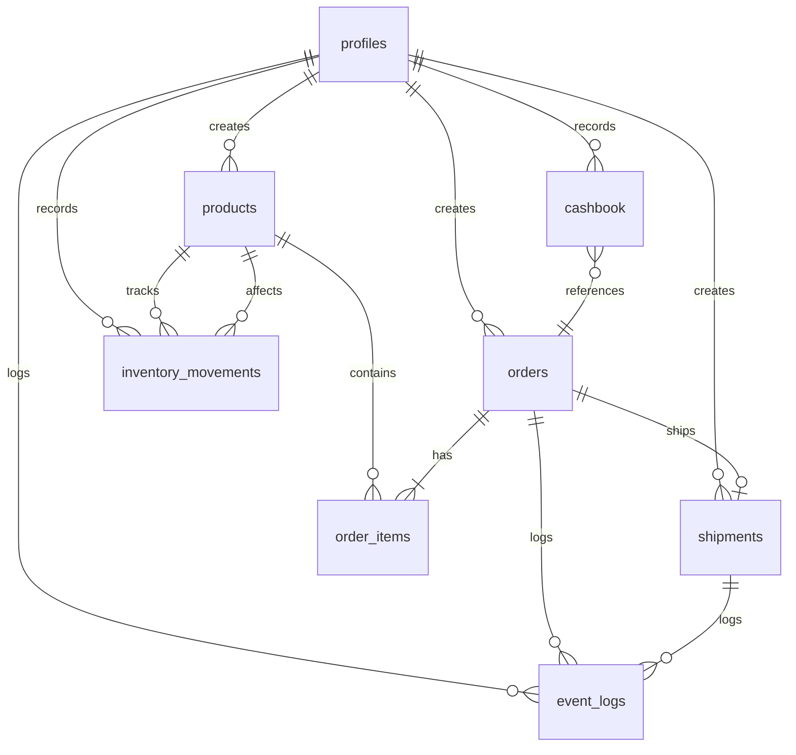

# Database ERD (Entity Relationship Diagram)
## YUANDI Collection Management System

> **Last Updated**: 2025-01-25  
> **Version**: 2.0.0  
> **Status**: Development (Iterative Refinement)

## 📊 Database Schema Overview

### Core Tables Structure



## 🗄️ Table Specifications

### 1. **profiles** (사용자 프로필)
```sql
- id: UUID (PK, references auth.users)
- name: VARCHAR(100) NOT NULL
- email: VARCHAR(255) NOT NULL UNIQUE
- phone: VARCHAR(20)
- role: user_role (Admin/OrderManager/ShipManager)
- locale: locale_type (ko/zh-CN)
- active: BOOLEAN
- last_login_at: TIMESTAMPTZ
- created_at: TIMESTAMPTZ
- updated_at: TIMESTAMPTZ
```

### 2. **products** (상품)
```sql
- id: UUID (PK)
- sku: VARCHAR(100) UNIQUE NOT NULL
- category: VARCHAR(50) NOT NULL
- name: VARCHAR(200) NOT NULL
- model: VARCHAR(100)
- color: VARCHAR(50)
- brand: VARCHAR(100)
- cost_cny: DECIMAL(10,2) NOT NULL
- sale_price_krw: DECIMAL(12,2)
- on_hand: INTEGER DEFAULT 0
- low_stock_threshold: INTEGER DEFAULT 5
- barcode: VARCHAR(50)
- image_url: VARCHAR(500) -- ✅ Added
- description: TEXT
- notes: TEXT
- active: BOOLEAN
- created_at: TIMESTAMPTZ
- updated_at: TIMESTAMPTZ
- created_by: UUID (FK → profiles)
```

### 3. **orders** (주문)
```sql
- id: UUID (PK)
- order_no: VARCHAR(20) UNIQUE NOT NULL
- order_date: DATE NOT NULL
- customer_name: VARCHAR(100) NOT NULL
- customer_phone: VARCHAR(20) NOT NULL
- customer_email: VARCHAR(255)
- pccc_code: VARCHAR(20) NOT NULL
- shipping_address: TEXT NOT NULL
- shipping_address_detail: TEXT
- zip_code: VARCHAR(10) NOT NULL
- status: order_status (PAID/SHIPPED/DONE/REFUNDED)
- total_amount: DECIMAL(12,2) NOT NULL
- currency: currency_type (CNY/KRW)
- customer_memo: TEXT
- internal_memo: TEXT
- created_at: TIMESTAMPTZ
- updated_at: TIMESTAMPTZ
- created_by: UUID (FK → profiles)
- updated_by: UUID (FK → profiles)

-- ⚠️ Deprecated columns (to be removed):
- tracking_number: VARCHAR(100) -- Use shipments table
- courier: VARCHAR(50) -- Use shipments table
- tracking_url: VARCHAR(500) -- Use shipments table
- tracking_number_cn: VARCHAR(100) -- Use shipments table
- courier_cn: VARCHAR(50) -- Use shipments table
- tracking_url_cn: VARCHAR(500) -- Use shipments table
- shipment_photo_url: VARCHAR(500) -- Use shipments table
```

### 4. **order_items** (주문 상품)
```sql
- id: UUID (PK)
- order_id: UUID NOT NULL (FK → orders)
- product_id: UUID NOT NULL (FK → products)
- sku: VARCHAR(100) NOT NULL
- product_name: VARCHAR(200) NOT NULL
- product_category: VARCHAR(50)
- product_model: VARCHAR(100)
- product_color: VARCHAR(50)
- product_brand: VARCHAR(100)
- quantity: INTEGER NOT NULL
- unit_price: DECIMAL(10,2) NOT NULL
- subtotal: DECIMAL(10,2) NOT NULL
- created_at: TIMESTAMPTZ
```

### 5. **shipments** (배송 정보) ✅ Enhanced
```sql
- id: UUID (PK)
- order_id: UUID UNIQUE NOT NULL (FK → orders)
-- Korean Shipping
- courier: VARCHAR(50) -- 한국 택배사
- courier_code: VARCHAR(20) -- 택배사 코드
- tracking_no: VARCHAR(50) -- 한국 운송장 번호
- tracking_barcode: VARCHAR(100) -- ✅ 바코드 번호
- tracking_url: VARCHAR(500) -- 한국 추적 URL
-- Chinese Shipping
- courier_cn: VARCHAR(50) -- 중국 택배사
- tracking_no_cn: VARCHAR(100) -- 중국 운송장 번호
- tracking_url_cn: VARCHAR(500) -- 중국 추적 URL
-- Shipping Details
- shipping_fee: DECIMAL(10,2) DEFAULT 0 -- 배송비
- actual_weight: DECIMAL(10,2) -- 실제 무게
- volume_weight: DECIMAL(10,2) -- 부피 무게
-- Photos
- shipment_photo_url: VARCHAR(500) -- 송장 사진
- receipt_photo_url: VARCHAR(500) -- ✅ 영수증 사진
-- Timestamps
- shipped_at: TIMESTAMPTZ
- delivered_at: TIMESTAMPTZ
- created_at: TIMESTAMPTZ
- created_by: UUID (FK → profiles)
```

### 6. **inventory_movements** (재고 이동)
```sql
- id: UUID (PK)
- product_id: UUID NOT NULL (FK → products)
- movement_type: movement_type (inbound/sale/adjustment/disposal)
- quantity: INTEGER NOT NULL
- balance_before: INTEGER NOT NULL
- balance_after: INTEGER NOT NULL
- ref_type: VARCHAR(50)
- ref_id: UUID
- ref_no: VARCHAR(50)
- unit_cost: DECIMAL(10,2)
- total_cost: DECIMAL(12,2)
- note: TEXT
- movement_date: DATE
- created_at: TIMESTAMPTZ
- created_by: UUID (FK → profiles)
```

### 7. **cashbook** (출납장부)
```sql
- id: UUID (PK)
- transaction_date: DATE NOT NULL
- type: cashbook_type (sale/inbound/shipping/adjustment/refund)
- amount: DECIMAL(12,2) NOT NULL
- currency: currency_type (CNY/KRW)
- fx_rate: DECIMAL(10,4) DEFAULT 1
- amount_krw: DECIMAL(12,2) NOT NULL
- ref_type: VARCHAR(50)
- ref_id: UUID
- ref_no: VARCHAR(50)
- description: TEXT
- note: TEXT
- bank_name: VARCHAR(50)
- account_no: VARCHAR(50)
- created_at: TIMESTAMPTZ
- created_by: UUID (FK → profiles)
```

### 8. **event_logs** (이벤트 로그)
```sql
- id: UUID (PK)
- actor_id: UUID (FK → profiles)
- actor_name: VARCHAR(100)
- actor_role: user_role
- event_type: VARCHAR(50) NOT NULL
- event_category: VARCHAR(50)
- event_severity: VARCHAR(20) DEFAULT 'info'
- entity_type: VARCHAR(50)
- entity_id: UUID
- entity_name: VARCHAR(200)
- action: VARCHAR(50)
- before_data: JSONB
- after_data: JSONB
- changes: JSONB
- ip_address: INET
- user_agent: TEXT
- request_id: UUID
- created_at: TIMESTAMPTZ
```

## 🔄 Migration History

| Version | Date | Changes |
|---------|------|---------|
| 1.0.0 | 2025-01-20 | Initial schema with basic tables |
| 1.1.0 | 2025-01-22 | Added Chinese shipping fields to orders & shipments |
| 1.2.0 | 2025-01-23 | Added stock management functions |
| 2.0.0 | 2025-01-25 | Major refactoring: Added products.image_url, shipments.tracking_barcode, shipments.receipt_photo_url |

## 🎯 Current Implementation Status

### ✅ Completed
1. **Core Tables**: All 8 main tables created
2. **Chinese Shipping Support**: Dual courier system (Korea + China)
3. **Product Images**: image_url column added to products
4. **Enhanced Shipments**: All shipping details columns mapped
5. **Barcode Support**: tracking_barcode field added
6. **Photo Uploads**: shipment_photo_url, receipt_photo_url support

### 🚧 In Progress
1. **Data Migration**: Moving tracking data from orders to shipments table
2. **UI Enhancement**: Mapping all shipments columns to UI fields
3. **API Updates**: Updating all endpoints to use shipments table

### 📋 Pending
1. **Remove Deprecated Columns**: Clean up orders table tracking fields
2. **Performance Optimization**: Add missing indexes
3. **RLS Policies**: Complete Row Level Security implementation

## 🔍 Key Design Decisions

### 1. Shipments Table Separation
- **Reason**: Clean separation of concerns (orders vs shipping)
- **Benefits**: Scalability, data integrity, easier maintenance
- **Implementation**: 1:1 relationship with orders table

### 2. Dual Courier System
- **Reason**: Business requires both Korean and Chinese shipping
- **Implementation**: Separate fields for each country's courier info
- **Tracking URLs**: Auto-generated based on courier company

### 3. Image Storage Strategy
- **Current**: Base64 encoded in database (development phase)
- **Future**: Supabase Storage with URL references (production)
- **Fields**: product images, shipment photos, receipt photos

### 4. Stock Management
- **Single Quantity**: on_hand field only (no reserved/available)
- **Real-time Updates**: Automatic deduction on order creation
- **Recovery**: Only on cancellation, not on refund

## 📝 Notes for Developers

1. **Always use shipments table** for shipping information, not orders table
2. **Check migration files** before making schema changes
3. **Update this ERD** when schema changes are made
4. **Test RLS policies** thoroughly before deployment
5. **Consider indexes** for frequently queried columns

## 🔗 Related Documents
- [PRD.md](./PRD.md) - Product Requirements Document
- [DATABASE_ISSUES.md](./database-issues.md) - Known Issues & Solutions
- [ITERATIVE_DEVELOPMENT.md](./ITERATIVE_DEVELOPMENT.md) - Development Process