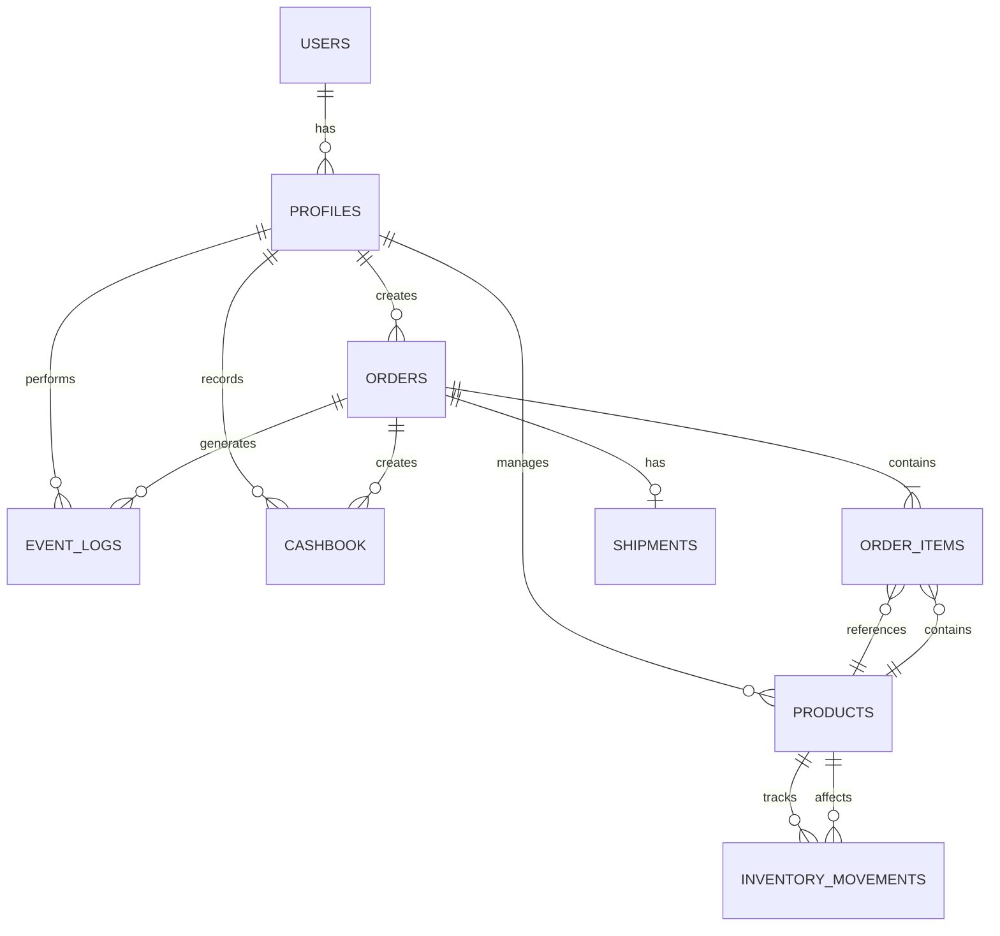

# 데이터베이스 스키마 설계서 - YUANDI 초미니 ERP

## 1. 데이터베이스 개요

### 1.1 DBMS 선택
- **PostgreSQL 15+** (Supabase 제공)
- **선택 이유**:
  - JSONB 지원으로 유연한 데이터 저장
  - Row Level Security (RLS)로 강력한 보안
  - Real-time subscriptions 지원
  - 자동 백업 및 복구 기능

### 1.2 설계 원칙
- **정규화**: 3NF 기준 적용하되, 성능을 위한 선택적 비정규화
- **인덱싱**: 쿼리 패턴 기반 최적화
- **RLS**: 모든 테이블에 Row Level Security 적용
- **Audit Trail**: 모든 중요 작업 자동 로깅

## 2. ERD (Entity Relationship Diagram)



## 3. 테이블 상세 설계

### 3.1 Enum Types (사용자 정의 타입)

```sql
-- 사용자 역할
CREATE TYPE user_role AS ENUM (
    'Admin',         -- 전체 관리자
    'OrderManager',  -- 주문 관리자
    'ShipManager'    -- 배송 관리자
);

-- 언어 설정
CREATE TYPE locale_type AS ENUM (
    'ko',     -- 한국어
    'zh-CN'   -- 중국어 간체
);

-- 주문 상태
CREATE TYPE order_status AS ENUM (
    'PAID',      -- 입금 확인
    'SHIPPED',   -- 배송 중
    'DONE',      -- 완료
    'REFUNDED'   -- 환불
);

-- 출납장부 거래 유형
CREATE TYPE cashbook_type AS ENUM (
    'sale',       -- 판매
    'inbound',    -- 입고
    'shipping',   -- 배송비
    'adjustment', -- 조정
    'refund'      -- 환불
);

-- 통화 유형
CREATE TYPE currency_type AS ENUM (
    'CNY',  -- 중국 위안
    'KRW'   -- 한국 원
);

-- 재고 이동 유형
CREATE TYPE movement_type AS ENUM (
    'inbound',    -- 입고
    'sale',       -- 판매
    'adjustment', -- 조정
    'disposal'    -- 폐기
);
```

### 3.2 Core Tables

#### profiles (사용자 프로필)
```sql
CREATE TABLE profiles (
    -- Primary Key
    id UUID PRIMARY KEY REFERENCES auth.users(id) ON DELETE CASCADE,
    
    -- Basic Info
    name VARCHAR(100) NOT NULL,
    email VARCHAR(255) NOT NULL UNIQUE,
    phone VARCHAR(20),
    
    -- Role & Settings
    role user_role NOT NULL DEFAULT 'OrderManager',
    locale locale_type NOT NULL DEFAULT 'ko',
    
    -- Status
    active BOOLEAN DEFAULT true,
    last_login_at TIMESTAMPTZ,
    
    -- Metadata
    created_at TIMESTAMPTZ DEFAULT NOW(),
    updated_at TIMESTAMPTZ DEFAULT NOW(),
    
    -- Constraints
    CONSTRAINT valid_email CHECK (email ~* '^[A-Za-z0-9._%+-]+@[A-Za-z0-9.-]+\.[A-Za-z]{2,}$'),
    CONSTRAINT valid_phone CHECK (phone ~* '^[0-9+\-\s]+$')
);

-- Indexes
CREATE INDEX idx_profiles_role ON profiles(role);
CREATE INDEX idx_profiles_active ON profiles(active);
```

#### products (상품)
```sql
CREATE TABLE products (
    -- Primary Key
    id UUID PRIMARY KEY DEFAULT gen_random_uuid(),
    
    -- SKU & Basic Info
    sku VARCHAR(100) UNIQUE NOT NULL,
    category VARCHAR(50) NOT NULL,
    name VARCHAR(200) NOT NULL,
    model VARCHAR(100),
    color VARCHAR(50),
    brand VARCHAR(100),
    
    -- Pricing
    cost_cny DECIMAL(10,2) NOT NULL CHECK (cost_cny >= 0),
    sale_price_krw DECIMAL(12,2),
    
    -- Inventory
    on_hand INTEGER DEFAULT 0 CHECK (on_hand >= 0),
    low_stock_threshold INTEGER DEFAULT 5 CHECK (low_stock_threshold >= 0),
    
    -- Additional Info
    barcode VARCHAR(50),
    description TEXT,
    notes TEXT,
    
    -- Status
    active BOOLEAN DEFAULT true,
    
    -- Metadata
    created_at TIMESTAMPTZ DEFAULT NOW(),
    updated_at TIMESTAMPTZ DEFAULT NOW(),
    created_by UUID REFERENCES profiles(id)
);

-- Indexes
CREATE INDEX idx_products_sku ON products(sku);
CREATE INDEX idx_products_category ON products(category);
CREATE INDEX idx_products_name_gin ON products USING gin(to_tsvector('simple', name));
CREATE INDEX idx_products_low_stock ON products(on_hand, low_stock_threshold) 
    WHERE active = true;
CREATE INDEX idx_products_composite ON products(category, model, color, brand);
```

#### orders (주문)
```sql
CREATE TABLE orders (
    -- Primary Key
    id UUID PRIMARY KEY DEFAULT gen_random_uuid(),
    
    -- Order Info
    order_no VARCHAR(20) UNIQUE NOT NULL,
    order_date DATE NOT NULL DEFAULT CURRENT_DATE,
    
    -- Customer Info
    customer_name VARCHAR(100) NOT NULL,
    customer_phone VARCHAR(20) NOT NULL,
    customer_email VARCHAR(255),
    
    -- Customs & Shipping
    pccc_code VARCHAR(20) NOT NULL,
    shipping_address TEXT NOT NULL,
    shipping_address_detail TEXT,
    zip_code VARCHAR(10) NOT NULL,
    
    -- Order Details
    status order_status NOT NULL DEFAULT 'PAID',
    total_amount DECIMAL(12,2) NOT NULL CHECK (total_amount >= 0),
    currency currency_type DEFAULT 'KRW',
    
    -- Notes
    customer_memo TEXT,
    internal_memo TEXT,
    
    -- Metadata
    created_at TIMESTAMPTZ DEFAULT NOW(),
    updated_at TIMESTAMPTZ DEFAULT NOW(),
    created_by UUID REFERENCES profiles(id),
    updated_by UUID REFERENCES profiles(id),
    
    -- Constraints
    CONSTRAINT valid_pccc CHECK (pccc_code ~* '^P[0-9]{12}$'),
    CONSTRAINT valid_phone CHECK (customer_phone ~* '^01[0-9]{8,9}$')
);

-- Indexes
CREATE INDEX idx_orders_order_no ON orders(order_no);
CREATE INDEX idx_orders_status ON orders(status);
CREATE INDEX idx_orders_customer ON orders(customer_name, customer_phone);
CREATE INDEX idx_orders_date ON orders(order_date DESC);
CREATE INDEX idx_orders_created_at ON orders(created_at DESC);
```

#### order_items (주문 상품)
```sql
CREATE TABLE order_items (
    -- Primary Key
    id UUID PRIMARY KEY DEFAULT gen_random_uuid(),
    
    -- Relations
    order_id UUID NOT NULL REFERENCES orders(id) ON DELETE CASCADE,
    product_id UUID NOT NULL REFERENCES products(id),
    
    -- Product Snapshot (주문 시점의 상품 정보)
    sku VARCHAR(100) NOT NULL,
    product_name VARCHAR(200) NOT NULL,
    product_category VARCHAR(50),
    product_model VARCHAR(100),
    product_color VARCHAR(50),
    product_brand VARCHAR(100),
    
    -- Quantity & Pricing
    quantity INTEGER NOT NULL CHECK (quantity > 0),
    unit_price DECIMAL(10,2) NOT NULL CHECK (unit_price >= 0),
    subtotal DECIMAL(10,2) NOT NULL CHECK (subtotal >= 0),
    
    -- Metadata
    created_at TIMESTAMPTZ DEFAULT NOW()
);

-- Indexes
CREATE INDEX idx_order_items_order ON order_items(order_id);
CREATE INDEX idx_order_items_product ON order_items(product_id);
```

#### shipments (배송)
```sql
CREATE TABLE shipments (
    -- Primary Key
    id UUID PRIMARY KEY DEFAULT gen_random_uuid(),
    
    -- Relations
    order_id UUID UNIQUE NOT NULL REFERENCES orders(id) ON DELETE CASCADE,
    
    -- Shipping Info
    courier VARCHAR(50) NOT NULL,
    courier_code VARCHAR(20),
    tracking_no VARCHAR(50) NOT NULL,
    tracking_url VARCHAR(500),
    
    -- Shipping Details
    shipping_fee DECIMAL(10,2) DEFAULT 0,
    actual_weight DECIMAL(10,2),
    volume_weight DECIMAL(10,2),
    
    -- Photos
    shipment_photo_url VARCHAR(500),
    receipt_photo_url VARCHAR(500),
    
    -- Dates
    shipped_at TIMESTAMPTZ DEFAULT NOW(),
    delivered_at TIMESTAMPTZ,
    
    -- Metadata
    created_at TIMESTAMPTZ DEFAULT NOW(),
    created_by UUID REFERENCES profiles(id)
);

-- Indexes
CREATE INDEX idx_shipments_order ON shipments(order_id);
CREATE INDEX idx_shipments_tracking ON shipments(tracking_no);
CREATE INDEX idx_shipments_shipped_at ON shipments(shipped_at DESC);
```

#### inventory_movements (재고 이동)
```sql
CREATE TABLE inventory_movements (
    -- Primary Key
    id UUID PRIMARY KEY DEFAULT gen_random_uuid(),
    
    -- Relations
    product_id UUID NOT NULL REFERENCES products(id),
    
    -- Movement Info
    movement_type movement_type NOT NULL,
    quantity INTEGER NOT NULL, -- positive for in, negative for out
    balance_before INTEGER NOT NULL,
    balance_after INTEGER NOT NULL,
    
    -- Reference (주문, 입고 등 참조)
    ref_type VARCHAR(50),
    ref_id UUID,
    ref_no VARCHAR(50),
    
    -- Details
    unit_cost DECIMAL(10,2),
    total_cost DECIMAL(12,2),
    note TEXT,
    
    -- Metadata
    movement_date DATE DEFAULT CURRENT_DATE,
    created_at TIMESTAMPTZ DEFAULT NOW(),
    created_by UUID REFERENCES profiles(id)
);

-- Indexes
CREATE INDEX idx_inventory_movements_product ON inventory_movements(product_id);
CREATE INDEX idx_inventory_movements_date ON inventory_movements(movement_date DESC);
CREATE INDEX idx_inventory_movements_ref ON inventory_movements(ref_type, ref_id);
```

#### cashbook (출납장부)
```sql
CREATE TABLE cashbook (
    -- Primary Key
    id UUID PRIMARY KEY DEFAULT gen_random_uuid(),
    
    -- Transaction Info
    transaction_date DATE NOT NULL DEFAULT CURRENT_DATE,
    type cashbook_type NOT NULL,
    
    -- Amount
    amount DECIMAL(12,2) NOT NULL,
    currency currency_type NOT NULL DEFAULT 'KRW',
    fx_rate DECIMAL(10,4) DEFAULT 1,
    amount_krw DECIMAL(12,2) NOT NULL,
    
    -- Reference
    ref_type VARCHAR(50),
    ref_id UUID,
    ref_no VARCHAR(50),
    
    -- Details
    description TEXT,
    note TEXT,
    
    -- Bank Info (optional)
    bank_name VARCHAR(50),
    account_no VARCHAR(50),
    
    -- Metadata
    created_at TIMESTAMPTZ DEFAULT NOW(),
    created_by UUID REFERENCES profiles(id),
    
    -- Constraints
    CONSTRAINT valid_fx_rate CHECK (fx_rate > 0)
);

-- Indexes
CREATE INDEX idx_cashbook_date ON cashbook(transaction_date DESC);
CREATE INDEX idx_cashbook_type ON cashbook(type);
CREATE INDEX idx_cashbook_ref ON cashbook(ref_type, ref_id);
CREATE INDEX idx_cashbook_month ON cashbook(DATE_TRUNC('month', transaction_date));
```

#### event_logs (이벤트 로그)
```sql
CREATE TABLE event_logs (
    -- Primary Key
    id UUID PRIMARY KEY DEFAULT gen_random_uuid(),
    
    -- Actor Info
    actor_id UUID REFERENCES profiles(id),
    actor_name VARCHAR(100),
    actor_role user_role,
    
    -- Event Info
    event_type VARCHAR(50) NOT NULL,
    event_category VARCHAR(50),
    event_severity VARCHAR(20) DEFAULT 'info', -- info, warning, error, critical
    
    -- Target Info
    entity_type VARCHAR(50),
    entity_id UUID,
    entity_name VARCHAR(200),
    
    -- Change Details
    action VARCHAR(50), -- create, update, delete, etc.
    before_data JSONB,
    after_data JSONB,
    changes JSONB, -- calculated diff
    
    -- Request Info
    ip_address INET,
    user_agent TEXT,
    request_id UUID,
    
    -- Metadata
    created_at TIMESTAMPTZ DEFAULT NOW()
);

-- Indexes
CREATE INDEX idx_event_logs_actor ON event_logs(actor_id);
CREATE INDEX idx_event_logs_entity ON event_logs(entity_type, entity_id);
CREATE INDEX idx_event_logs_created_at ON event_logs(created_at DESC);
CREATE INDEX idx_event_logs_event_type ON event_logs(event_type);
CREATE INDEX idx_event_logs_severity ON event_logs(event_severity) 
    WHERE event_severity IN ('warning', 'error', 'critical');
```

## 4. Functions & Procedures

### 4.1 Order Number Generation
```sql
CREATE OR REPLACE FUNCTION generate_order_number()
RETURNS TEXT AS $$
DECLARE
    today_date TEXT;
    seq_num INTEGER;
    new_order_no TEXT;
    max_retries INTEGER := 5;
    retry_count INTEGER := 0;
BEGIN
    -- KST 기준 날짜
    today_date := TO_CHAR(NOW() AT TIME ZONE 'Asia/Seoul', 'YYMMDD');
    
    LOOP
        -- 오늘의 다음 시퀀스 번호 계산
        SELECT COALESCE(MAX(
            CAST(SUBSTRING(order_no FROM 12 FOR 3) AS INTEGER)
        ), 0) + 1 INTO seq_num
        FROM orders
        WHERE order_no LIKE 'ORD-' || today_date || '-%';
        
        -- 주문번호 생성
        new_order_no := 'ORD-' || today_date || '-' || LPAD(seq_num::TEXT, 3, '0');
        
        -- 중복 체크
        IF NOT EXISTS (SELECT 1 FROM orders WHERE order_no = new_order_no) THEN
            RETURN new_order_no;
        END IF;
        
        -- 재시도 제한
        retry_count := retry_count + 1;
        IF retry_count >= max_retries THEN
            RAISE EXCEPTION 'Failed to generate unique order number';
        END IF;
    END LOOP;
END;
$$ LANGUAGE plpgsql;
```

### 4.2 SKU Generation
```sql
CREATE OR REPLACE FUNCTION generate_sku(
    p_category VARCHAR,
    p_model VARCHAR,
    p_color VARCHAR,
    p_brand VARCHAR
)
RETURNS TEXT AS $$
DECLARE
    hash_value TEXT;
    new_sku TEXT;
    clean_category TEXT;
    clean_model TEXT;
    clean_color TEXT;
    clean_brand TEXT;
BEGIN
    -- 입력값 정리 (특수문자 제거, 대문자 변환)
    clean_category := UPPER(REGEXP_REPLACE(COALESCE(p_category, 'NONE'), '[^A-Za-z0-9]', '', 'g'));
    clean_model := UPPER(REGEXP_REPLACE(COALESCE(p_model, 'STD'), '[^A-Za-z0-9]', '', 'g'));
    clean_color := UPPER(REGEXP_REPLACE(COALESCE(p_color, 'NA'), '[^A-Za-z0-9]', '', 'g'));
    clean_brand := UPPER(REGEXP_REPLACE(COALESCE(p_brand, 'GEN'), '[^A-Za-z0-9]', '', 'g'));
    
    -- 길이 제한
    clean_category := SUBSTRING(clean_category FROM 1 FOR 10);
    clean_model := SUBSTRING(clean_model FROM 1 FOR 15);
    clean_color := SUBSTRING(clean_color FROM 1 FOR 10);
    clean_brand := SUBSTRING(clean_brand FROM 1 FOR 10);
    
    -- 해시 생성
    hash_value := UPPER(SUBSTRING(
        MD5(CONCAT(clean_category, clean_model, clean_color, clean_brand, NOW()::TEXT)), 
        1, 5
    ));
    
    -- SKU 조합
    new_sku := clean_category || '-' || clean_model || '-' || 
               clean_color || '-' || clean_brand || '-' || hash_value;
    
    RETURN new_sku;
END;
$$ LANGUAGE plpgsql;
```

### 4.3 Stock Validation
```sql
CREATE OR REPLACE FUNCTION validate_stock(
    p_product_id UUID,
    p_quantity INTEGER
)
RETURNS BOOLEAN AS $$
DECLARE
    current_stock INTEGER;
BEGIN
    SELECT on_hand INTO current_stock
    FROM products
    WHERE id = p_product_id AND active = true
    FOR UPDATE; -- Lock the row
    
    RETURN current_stock >= p_quantity;
END;
$$ LANGUAGE plpgsql;
```

### 4.4 Create Order with Items (Transaction)
```sql
CREATE OR REPLACE FUNCTION create_order_with_items(
    p_customer_name VARCHAR,
    p_customer_phone VARCHAR,
    p_pccc_code VARCHAR,
    p_shipping_address TEXT,
    p_zip_code VARCHAR,
    p_items JSONB,
    p_created_by UUID
)
RETURNS JSONB AS $$
DECLARE
    v_order_id UUID;
    v_order_no VARCHAR;
    v_total_amount DECIMAL(12,2) := 0;
    v_item JSONB;
    v_product RECORD;
    v_quantity INTEGER;
BEGIN
    -- Generate order number
    v_order_no := generate_order_number();
    
    -- Create order
    INSERT INTO orders (
        order_no, customer_name, customer_phone, 
        pccc_code, shipping_address, zip_code,
        status, total_amount, created_by
    ) VALUES (
        v_order_no, p_customer_name, p_customer_phone,
        p_pccc_code, p_shipping_address, p_zip_code,
        'PAID', 0, p_created_by
    ) RETURNING id INTO v_order_id;
    
    -- Process order items
    FOR v_item IN SELECT * FROM jsonb_array_elements(p_items)
    LOOP
        -- Get product info and lock for update
        SELECT * INTO v_product
        FROM products
        WHERE id = (v_item->>'product_id')::UUID
        FOR UPDATE;
        
        v_quantity := (v_item->>'quantity')::INTEGER;
        
        -- Validate stock
        IF v_product.on_hand < v_quantity THEN
            RAISE EXCEPTION 'Insufficient stock for product %', v_product.name;
        END IF;
        
        -- Insert order item
        INSERT INTO order_items (
            order_id, product_id, sku, product_name,
            quantity, unit_price, subtotal
        ) VALUES (
            v_order_id, v_product.id, v_product.sku, v_product.name,
            v_quantity, v_product.sale_price_krw, 
            v_product.sale_price_krw * v_quantity
        );
        
        -- Update stock
        UPDATE products
        SET on_hand = on_hand - v_quantity
        WHERE id = v_product.id;
        
        -- Record inventory movement
        INSERT INTO inventory_movements (
            product_id, movement_type, quantity,
            balance_before, balance_after,
            ref_type, ref_id, created_by
        ) VALUES (
            v_product.id, 'sale', -v_quantity,
            v_product.on_hand, v_product.on_hand - v_quantity,
            'order', v_order_id, p_created_by
        );
        
        -- Calculate total
        v_total_amount := v_total_amount + (v_product.sale_price_krw * v_quantity);
    END LOOP;
    
    -- Update order total
    UPDATE orders
    SET total_amount = v_total_amount
    WHERE id = v_order_id;
    
    -- Record in cashbook
    INSERT INTO cashbook (
        type, amount, currency, amount_krw,
        ref_type, ref_id, created_by
    ) VALUES (
        'sale', v_total_amount, 'KRW', v_total_amount,
        'order', v_order_id, p_created_by
    );
    
    -- Log event
    INSERT INTO event_logs (
        actor_id, event_type, entity_type, entity_id,
        action, after_data
    ) VALUES (
        p_created_by, 'order.created', 'order', v_order_id,
        'create', jsonb_build_object('order_no', v_order_no, 'amount', v_total_amount)
    );
    
    RETURN jsonb_build_object(
        'order_id', v_order_id,
        'order_no', v_order_no,
        'total_amount', v_total_amount
    );
END;
$$ LANGUAGE plpgsql;
```

## 5. Triggers

### 5.1 Auto-generate Order Number
```sql
CREATE OR REPLACE FUNCTION before_order_insert()
RETURNS TRIGGER AS $$
BEGIN
    IF NEW.order_no IS NULL THEN
        NEW.order_no := generate_order_number();
    END IF;
    RETURN NEW;
END;
$$ LANGUAGE plpgsql;

CREATE TRIGGER trigger_order_number
BEFORE INSERT ON orders
FOR EACH ROW
EXECUTE FUNCTION before_order_insert();
```

### 5.2 Auto-generate SKU
```sql
CREATE OR REPLACE FUNCTION before_product_insert()
RETURNS TRIGGER AS $$
BEGIN
    IF NEW.sku IS NULL THEN
        NEW.sku := generate_sku(NEW.category, NEW.model, NEW.color, NEW.brand);
    END IF;
    RETURN NEW;
END;
$$ LANGUAGE plpgsql;

CREATE TRIGGER trigger_product_sku
BEFORE INSERT ON products
FOR EACH ROW
EXECUTE FUNCTION before_product_insert();
```

### 5.3 Update Timestamps
```sql
CREATE OR REPLACE FUNCTION update_updated_at()
RETURNS TRIGGER AS $$
BEGIN
    NEW.updated_at = NOW();
    RETURN NEW;
END;
$$ LANGUAGE plpgsql;

-- Apply to all tables with updated_at
CREATE TRIGGER update_profiles_updated_at 
BEFORE UPDATE ON profiles
FOR EACH ROW EXECUTE FUNCTION update_updated_at();

CREATE TRIGGER update_products_updated_at 
BEFORE UPDATE ON products
FOR EACH ROW EXECUTE FUNCTION update_updated_at();

CREATE TRIGGER update_orders_updated_at 
BEFORE UPDATE ON orders
FOR EACH ROW EXECUTE FUNCTION update_updated_at();
```

### 5.4 Audit Log Trigger
```sql
CREATE OR REPLACE FUNCTION log_changes()
RETURNS TRIGGER AS $$
DECLARE
    v_entity_name TEXT;
    v_changes JSONB;
BEGIN
    -- Determine entity name
    CASE TG_TABLE_NAME
        WHEN 'orders' THEN 
            v_entity_name := NEW.order_no;
        WHEN 'products' THEN 
            v_entity_name := NEW.name;
        ELSE 
            v_entity_name := NULL;
    END CASE;
    
    -- Calculate changes for UPDATE
    IF TG_OP = 'UPDATE' THEN
        v_changes := jsonb_strip_nulls(
            jsonb_build_object(
                'fields', (
                    SELECT jsonb_object_agg(key, jsonb_build_object('old', old_val, 'new', new_val))
                    FROM (
                        SELECT key, 
                               to_jsonb(OLD) -> key as old_val,
                               to_jsonb(NEW) -> key as new_val
                        FROM jsonb_object_keys(to_jsonb(NEW)) AS key
                        WHERE (to_jsonb(OLD) -> key) IS DISTINCT FROM (to_jsonb(NEW) -> key)
                    ) changes
                )
            )
        );
    END IF;
    
    -- Log the event
    INSERT INTO event_logs (
        actor_id,
        event_type,
        entity_type,
        entity_id,
        entity_name,
        action,
        before_data,
        after_data,
        changes
    ) VALUES (
        current_setting('app.current_user_id', true)::UUID,
        TG_TABLE_NAME || '.' || LOWER(TG_OP),
        TG_TABLE_NAME,
        NEW.id,
        v_entity_name,
        LOWER(TG_OP),
        CASE WHEN TG_OP = 'DELETE' THEN to_jsonb(OLD) ELSE NULL END,
        CASE WHEN TG_OP != 'DELETE' THEN to_jsonb(NEW) ELSE NULL END,
        v_changes
    );
    
    RETURN NEW;
END;
$$ LANGUAGE plpgsql;

-- Apply to important tables
CREATE TRIGGER log_orders_changes
AFTER INSERT OR UPDATE OR DELETE ON orders
FOR EACH ROW EXECUTE FUNCTION log_changes();

CREATE TRIGGER log_products_changes
AFTER INSERT OR UPDATE OR DELETE ON products
FOR EACH ROW EXECUTE FUNCTION log_changes();
```

## 6. Indexes Strategy

### 6.1 Performance Indexes
```sql
-- Orders: Frequent queries by status and date
CREATE INDEX idx_orders_status_date ON orders(status, order_date DESC);
CREATE INDEX idx_orders_customer_lookup ON orders(customer_name, customer_phone, created_at DESC);

-- Products: Search and filtering
CREATE INDEX idx_products_search ON products(name, brand, model);
CREATE INDEX idx_products_active_stock ON products(active, on_hand) WHERE active = true;

-- Cashbook: Financial reporting
CREATE INDEX idx_cashbook_reporting ON cashbook(transaction_date, type, amount_krw);
CREATE INDEX idx_cashbook_monthly ON cashbook(
    DATE_TRUNC('month', transaction_date), 
    type
);

-- Event logs: Audit trail
CREATE INDEX idx_event_logs_audit ON event_logs(
    entity_type, 
    entity_id, 
    created_at DESC
);
```

### 6.2 Full-text Search Indexes
```sql
-- Product search
CREATE INDEX idx_products_fts ON products 
USING gin(
    to_tsvector('simple', 
        COALESCE(name, '') || ' ' || 
        COALESCE(brand, '') || ' ' || 
        COALESCE(model, '') || ' ' ||
        COALESCE(category, '')
    )
);

-- Order search
CREATE INDEX idx_orders_fts ON orders
USING gin(
    to_tsvector('simple',
        COALESCE(customer_name, '') || ' ' ||
        COALESCE(order_no, '') || ' ' ||
        COALESCE(customer_phone, '')
    )
);
```

## 7. Row Level Security (RLS)

### 7.1 Enable RLS
```sql
-- Enable RLS on all tables
ALTER TABLE profiles ENABLE ROW LEVEL SECURITY;
ALTER TABLE products ENABLE ROW LEVEL SECURITY;
ALTER TABLE orders ENABLE ROW LEVEL SECURITY;
ALTER TABLE order_items ENABLE ROW LEVEL SECURITY;
ALTER TABLE shipments ENABLE ROW LEVEL SECURITY;
ALTER TABLE event_logs ENABLE ROW LEVEL SECURITY;
ALTER TABLE cashbook ENABLE ROW LEVEL SECURITY;
ALTER TABLE inventory_movements ENABLE ROW LEVEL SECURITY;
```

### 7.2 RLS Policies

#### Profiles Policies
```sql
-- Users can read their own profile
CREATE POLICY profiles_select_own ON profiles
FOR SELECT USING (auth.uid() = id);

-- Admin can read all profiles
CREATE POLICY profiles_select_admin ON profiles
FOR SELECT USING (
    EXISTS (
        SELECT 1 FROM profiles 
        WHERE id = auth.uid() AND role = 'Admin'
    )
);

-- Admin can update all profiles
CREATE POLICY profiles_update_admin ON profiles
FOR UPDATE USING (
    EXISTS (
        SELECT 1 FROM profiles 
        WHERE id = auth.uid() AND role = 'Admin'
    )
);
```

#### Products Policies
```sql
-- All authenticated users can read products
CREATE POLICY products_select ON products
FOR SELECT USING (auth.uid() IS NOT NULL);

-- Admin and OrderManager can insert products
CREATE POLICY products_insert ON products
FOR INSERT WITH CHECK (
    EXISTS (
        SELECT 1 FROM profiles 
        WHERE id = auth.uid() 
        AND role IN ('Admin', 'OrderManager')
    )
);

-- Admin and OrderManager can update products
CREATE POLICY products_update ON products
FOR UPDATE USING (
    EXISTS (
        SELECT 1 FROM profiles 
        WHERE id = auth.uid() 
        AND role IN ('Admin', 'OrderManager')
    )
);
```

#### Orders Policies
```sql
-- All authenticated users can read orders
CREATE POLICY orders_select ON orders
FOR SELECT USING (
    EXISTS (
        SELECT 1 FROM profiles 
        WHERE id = auth.uid()
    )
);

-- Admin and OrderManager can create orders
CREATE POLICY orders_insert ON orders
FOR INSERT WITH CHECK (
    EXISTS (
        SELECT 1 FROM profiles 
        WHERE id = auth.uid() 
        AND role IN ('Admin', 'OrderManager')
    )
);

-- Update based on role and status
CREATE POLICY orders_update ON orders
FOR UPDATE USING (
    CASE 
        -- Admin can update any order
        WHEN EXISTS (
            SELECT 1 FROM profiles 
            WHERE id = auth.uid() AND role = 'Admin'
        ) THEN true
        
        -- OrderManager can update PAID orders only
        WHEN EXISTS (
            SELECT 1 FROM profiles 
            WHERE id = auth.uid() AND role = 'OrderManager'
        ) AND status = 'PAID' THEN true
        
        -- ShipManager can update for shipping
        WHEN EXISTS (
            SELECT 1 FROM profiles 
            WHERE id = auth.uid() AND role = 'ShipManager'
        ) AND status IN ('PAID', 'SHIPPED') THEN true
        
        ELSE false
    END
);
```

## 8. Materialized Views

### 8.1 Dashboard Summary View
```sql
CREATE MATERIALIZED VIEW mv_dashboard_summary AS
WITH date_series AS (
    SELECT generate_series(
        CURRENT_DATE - INTERVAL '30 days',
        CURRENT_DATE,
        '1 day'::INTERVAL
    )::DATE as date
),
daily_sales AS (
    SELECT 
        order_date as date,
        COUNT(*) as order_count,
        SUM(total_amount) as total_sales,
        COUNT(DISTINCT customer_phone) as unique_customers
    FROM orders
    WHERE status NOT IN ('REFUNDED')
    GROUP BY order_date
)
SELECT 
    ds.date,
    COALESCE(s.order_count, 0) as order_count,
    COALESCE(s.total_sales, 0) as total_sales,
    COALESCE(s.unique_customers, 0) as unique_customers
FROM date_series ds
LEFT JOIN daily_sales s ON ds.date = s.date
ORDER BY ds.date DESC;

-- Create index
CREATE UNIQUE INDEX idx_mv_dashboard_summary_date ON mv_dashboard_summary(date);

-- Refresh function
CREATE OR REPLACE FUNCTION refresh_dashboard_summary()
RETURNS void AS $$
BEGIN
    REFRESH MATERIALIZED VIEW CONCURRENTLY mv_dashboard_summary;
END;
$$ LANGUAGE plpgsql;
```

### 8.2 Low Stock Products View
```sql
CREATE MATERIALIZED VIEW mv_low_stock_products AS
SELECT 
    p.id,
    p.sku,
    p.name,
    p.category,
    p.brand,
    p.on_hand,
    p.low_stock_threshold,
    p.on_hand - p.low_stock_threshold as stock_difference,
    CASE 
        WHEN p.on_hand = 0 THEN 'out_of_stock'
        WHEN p.on_hand <= p.low_stock_threshold THEN 'low_stock'
        ELSE 'normal'
    END as stock_status
FROM products p
WHERE p.active = true
AND p.on_hand <= p.low_stock_threshold
ORDER BY stock_difference ASC;

-- Create index
CREATE UNIQUE INDEX idx_mv_low_stock_products_id ON mv_low_stock_products(id);
```

## 9. Performance Optimization

### 9.1 Partitioning Strategy
```sql
-- Partition event_logs by month
CREATE TABLE event_logs_2024_01 PARTITION OF event_logs
FOR VALUES FROM ('2024-01-01') TO ('2024-02-01');

CREATE TABLE event_logs_2024_02 PARTITION OF event_logs
FOR VALUES FROM ('2024-02-01') TO ('2024-03-01');

-- Auto-create partitions (using pg_partman extension)
```

### 9.2 Query Optimization
```sql
-- Optimized dashboard query
CREATE OR REPLACE FUNCTION get_dashboard_metrics(
    p_start_date DATE,
    p_end_date DATE
)
RETURNS TABLE (
    metric_type VARCHAR,
    metric_value NUMERIC
) AS $$
BEGIN
    RETURN QUERY
    WITH metrics AS (
        SELECT 
            'total_sales' as metric_type,
            SUM(total_amount) as metric_value
        FROM orders
        WHERE order_date BETWEEN p_start_date AND p_end_date
        AND status != 'REFUNDED'
        
        UNION ALL
        
        SELECT 
            'order_count',
            COUNT(*)::NUMERIC
        FROM orders
        WHERE order_date BETWEEN p_start_date AND p_end_date
        
        UNION ALL
        
        SELECT 
            'avg_order_value',
            AVG(total_amount)
        FROM orders
        WHERE order_date BETWEEN p_start_date AND p_end_date
        AND status != 'REFUNDED'
    )
    SELECT * FROM metrics;
END;
$$ LANGUAGE plpgsql;
```

## 10. Backup & Recovery

### 10.1 Backup Strategy
```sql
-- Point-in-time recovery configuration
ALTER SYSTEM SET wal_level = replica;
ALTER SYSTEM SET archive_mode = on;
ALTER SYSTEM SET archive_command = 'cp %p /backup/archive/%f';

-- Backup script
-- pg_basebackup -D /backup/base -Ft -z -P
```

### 10.2 Monitoring Queries
```sql
-- Table sizes
SELECT 
    schemaname,
    tablename,
    pg_size_pretty(pg_total_relation_size(schemaname||'.'||tablename)) as size
FROM pg_tables
WHERE schemaname = 'public'
ORDER BY pg_total_relation_size(schemaname||'.'||tablename) DESC;

-- Slow queries
SELECT 
    query,
    calls,
    total_time,
    mean_time,
    max_time
FROM pg_stat_statements
ORDER BY mean_time DESC
LIMIT 10;

-- Index usage
SELECT 
    schemaname,
    tablename,
    indexname,
    idx_scan,
    idx_tup_read,
    idx_tup_fetch
FROM pg_stat_user_indexes
ORDER BY idx_scan DESC;
```

---

**문서 버전**: 1.0.0
**작성일**: 2024-12-28
**작성자**: YUANDI Database Architect