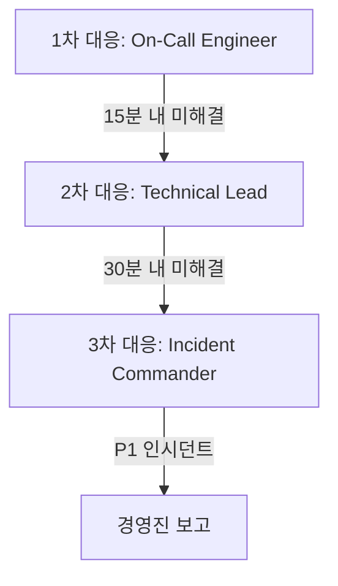

# YUANDI ERP - 인시던트 대응 플레이북

## 📋 목차

1. [인시던트 대응 개요](#인시던트-대응-개요)
2. [인시던트 분류 및 우선순위](#인시던트-분류-및-우선순위)
3. [대응 팀 구성 및 역할](#대응-팀-구성-및-역할)
4. [인시던트 대응 프로세스](#인시던트-대응-프로세스)
5. [시나리오별 대응 가이드](#시나리오별-대응-가이드)
6. [커뮤니케이션 계획](#커뮤니케이션-계획)
7. [복구 절차](#복구-절차)
8. [사후 분석](#사후-분석)
9. [연락처 및 리소스](#연락처-및-리소스)

---

## 🚨 인시던트 대응 개요

### 목적
이 플레이북은 YUANDI ERP 시스템에서 발생할 수 있는 인시던트에 대한 체계적이고 신속한 대응을 위한 가이드입니다.

### 원칙
1. **신속성**: 빠른 감지와 대응
2. **정확성**: 정확한 상황 파악과 조치
3. **투명성**: 이해관계자와의 명확한 소통
4. **학습**: 인시던트로부터의 개선점 도출

### 적용 범위
- 시스템 장애 및 서비스 중단
- 보안 침해 및 데이터 유출
- 성능 저하 및 용량 초과
- 데이터 손실 및 무결성 문제

---

## 🎯 인시던트 분류 및 우선순위

### 심각도 레벨

| 레벨 | 명칭 | 영향도 | 대응 시간 | 에스컬레이션 |
|------|------|--------|-----------|--------------|
| **P1** | Critical | 전체 서비스 중단, 데이터 손실 | 15분 이내 | 즉시 |
| **P2** | High | 주요 기능 장애, 다수 사용자 영향 | 30분 이내 | 30분 |
| **P3** | Medium | 부분 기능 장애, 일부 사용자 영향 | 2시간 이내 | 2시간 |
| **P4** | Low | 경미한 문제, 우회 가능 | 24시간 이내 | 필요시 |

### 인시던트 유형

#### 1. 서비스 중단 (Outage)
- 웹사이트 접속 불가
- API 응답 없음
- 데이터베이스 연결 실패

#### 2. 성능 저하 (Performance)
- 응답 시간 지연 (>3초)
- 타임아웃 발생
- 높은 에러율 (>5%)

#### 3. 보안 인시던트 (Security)
- 비인가 접근 시도
- 데이터 유출 의심
- DDoS 공격

#### 4. 데이터 문제 (Data)
- 데이터 불일치
- 백업 실패
- 데이터 손실

---

## 👥 대응 팀 구성 및 역할

### 인시던트 대응팀 (IRT)

| 역할 | 책임 | 담당자 | 연락처 |
|------|------|--------|--------|
| **Incident Commander** | 전체 대응 총괄, 의사결정 | CTO | 010-XXXX-XXXX |
| **Technical Lead** | 기술적 문제 해결 주도 | Lead Developer | 010-XXXX-XXXX |
| **Communications Lead** | 내외부 커뮤니케이션 | Product Manager | 010-XXXX-XXXX |
| **Security Lead** | 보안 관련 대응 | Security Engineer | 010-XXXX-XXXX |
| **Operations Lead** | 인프라 및 운영 | DevOps Engineer | 010-XXXX-XXXX |

### 에스컬레이션 체계



---

## 📋 인시던트 대응 프로세스

### Phase 1: 감지 및 분류 (Detect & Triage)

#### 체크리스트
- [ ] 알림 확인 (모니터링, 사용자 신고)
- [ ] 영향 범위 파악
- [ ] 심각도 레벨 결정
- [ ] 인시던트 티켓 생성
- [ ] 대응팀 소집

#### 초기 정보 수집
```bash
# 시스템 상태 확인
curl -I https://yuandi.com
curl https://yuandi.com/api/health

# 로그 확인
vercel logs --prod --since 30m
supabase logs --tail

# 메트릭 확인
# Vercel Dashboard → Analytics
# Supabase Dashboard → Metrics
```

### Phase 2: 대응 (Respond)

#### 즉시 조치사항
1. **상황 파악**
   ```bash
   # 서비스 상태 확인
   ./scripts/health-check.sh
   
   # 에러 로그 수집
   ./scripts/collect-logs.sh
   ```

2. **임시 조치**
   - 트래픽 제한 또는 차단
   - 문제 서비스 격리
   - 캐시 활성화
   - 백업 시스템 전환

3. **상태 페이지 업데이트**
   ```bash
   # status.yuandi.com 업데이트
   curl -X POST https://api.statuspage.io/v1/incidents \
     -H "Authorization: OAuth $TOKEN" \
     -d '{"incident": {"name": "서비스 장애", "status": "investigating"}}'
   ```

### Phase 3: 복구 (Recover)

#### 복구 작업
1. **근본 원인 해결**
2. **서비스 재시작**
3. **기능 검증**
4. **모니터링 강화**

### Phase 4: 완료 (Close)

#### 종료 기준
- [ ] 서비스 정상 작동 확인
- [ ] 모든 알림 해제
- [ ] 30분간 안정성 확인
- [ ] 이해관계자 통보
- [ ] 인시던트 문서화

---

## 🎬 시나리오별 대응 가이드

### 시나리오 1: 웹사이트 접속 불가

#### 증상
- 메인 페이지 접속 실패
- 504 Gateway Timeout

#### 진단
```bash
# 1. Vercel 상태 확인
vercel inspect yuandi-erp

# 2. DNS 확인
nslookup yuandi.com
dig yuandi.com

# 3. SSL 인증서 확인
openssl s_client -connect yuandi.com:443 -servername yuandi.com
```

#### 대응
```bash
# 1. Vercel 재배포
vercel --prod --force

# 2. CDN 캐시 제거
curl -X PURGE https://yuandi.com/*

# 3. 이전 버전으로 롤백
vercel rollback
```

### 시나리오 2: 데이터베이스 연결 실패

#### 증상
- API 500 에러
- "Database connection failed" 메시지

#### 진단
```bash
# 1. Supabase 상태 확인
supabase status

# 2. 연결 테스트
psql $DATABASE_URL -c "SELECT 1"

# 3. Connection pool 상태
SELECT count(*) FROM pg_stat_activity;
```

#### 대응
```bash
# 1. Connection pool 재시작
supabase db reset-pool

# 2. 활성 연결 종료
SELECT pg_terminate_backend(pid) 
FROM pg_stat_activity 
WHERE state = 'idle' AND query_start < NOW() - INTERVAL '10 minutes';

# 3. 데이터베이스 재시작 (최후 수단)
supabase db restart
```

### 시나리오 3: 높은 CPU/메모리 사용

#### 증상
- 응답 시간 지연
- 타임아웃 증가

#### 진단
```bash
# 1. 리소스 사용 확인
vercel inspect yuandi-erp --metrics

# 2. 느린 쿼리 확인
SELECT query, calls, mean_exec_time
FROM pg_stat_statements
ORDER BY mean_exec_time DESC
LIMIT 10;

# 3. 메모리 누수 확인
# Vercel Functions 로그 확인
```

#### 대응
```bash
# 1. 함수 메모리 증가
vercel env add FUNCTION_MEMORY_SIZE 3008

# 2. 스케일링
vercel scale yuandi-erp --min 2 --max 10

# 3. 캐시 활성화
vercel env add ENABLE_CACHE true
```

### 시나리오 4: DDoS 공격

#### 증상
- 비정상적 트래픽 증가
- 특정 IP에서 대량 요청

#### 진단
```bash
# 1. 트래픽 패턴 분석
# Vercel Analytics 확인

# 2. 공격 IP 식별
grep "429" access.log | awk '{print $1}' | sort | uniq -c | sort -rn

# 3. 요청 패턴 분석
```

#### 대응
```bash
# 1. Rate limiting 강화
vercel env add RATE_LIMIT_PER_IP 10

# 2. IP 차단 (Vercel Firewall)
vercel firewall add --block 1.2.3.4

# 3. Cloudflare 활성화 (필요시)
# DNS를 Cloudflare로 변경
```

### 시나리오 5: 데이터 손실/손상

#### 증상
- 데이터 불일치
- 레코드 누락

#### 진단
```sql
-- 1. 데이터 무결성 확인
SELECT COUNT(*) FROM orders WHERE created_at > NOW() - INTERVAL '1 day';

-- 2. 외래키 제약 확인
SELECT conname, conrelid::regclass, confrelid::regclass
FROM pg_constraint
WHERE contype = 'f' AND NOT convalidated;

-- 3. 감사 로그 확인
SELECT * FROM event_logs 
WHERE created_at > NOW() - INTERVAL '1 hour'
ORDER BY created_at DESC;
```

#### 대응
```bash
# 1. 백업에서 복구
./scripts/restore-from-backup.sh 2024-08-23_03:00

# 2. Point-in-time recovery
supabase db restore --pitr "2024-08-23 02:00:00"

# 3. 수동 데이터 복구
psql $DATABASE_URL < /backups/manual_fix.sql
```

---

## 📢 커뮤니케이션 계획

### 내부 커뮤니케이션

#### Slack 채널
- `#incidents`: 인시던트 대응 조정
- `#alerts`: 자동 알림
- `#status-updates`: 상태 업데이트

#### 템플릿
```
🚨 인시던트 발생
- 시간: YYYY-MM-DD HH:MM
- 레벨: P1/P2/P3/P4
- 영향: [영향 설명]
- 현재 상태: 조사중/대응중/모니터링
- 담당: @담당자
- 다음 업데이트: HH:MM
```

### 외부 커뮤니케이션

#### 고객 공지 (P1, P2)

**초기 공지 (15분 이내)**
```
안녕하세요, YUANDI 고객님

현재 일부 서비스에 접속 장애가 발생하고 있습니다.
- 영향 범위: [영향 설명]
- 예상 복구 시간: 조사 중
- 우회 방법: [있는 경우]

불편을 드려 죄송합니다. 신속히 해결하겠습니다.
```

**진행 상황 업데이트 (30분마다)**
```
[업데이트 HH:MM]
- 현재 상태: [상태]
- 진행 사항: [작업 내용]
- 예상 복구 시간: HH:MM
```

**해결 공지**
```
[해결 완료 HH:MM]
서비스가 정상 복구되었습니다.
- 장애 시간: HH:MM - HH:MM (총 X시간)
- 원인: [간단한 설명]
- 재발 방지: [조치 사항]

이용에 불편을 드려 진심으로 사과드립니다.
```

---

## 🔧 복구 절차

### 1. 서비스 복구 체크리스트

#### 애플리케이션
- [ ] 웹 서버 정상 작동
- [ ] API 엔드포인트 응답
- [ ] 인증 시스템 작동
- [ ] 세션 관리 정상

#### 데이터베이스
- [ ] 연결 정상
- [ ] 쿼리 실행 가능
- [ ] 복제 동기화
- [ ] 백업 작동

#### 인프라
- [ ] CDN 정상
- [ ] DNS 해석
- [ ] SSL 인증서
- [ ] 로드 밸런서

### 2. 검증 스크립트

```bash
#!/bin/bash
# scripts/verify-recovery.sh

echo "=== 복구 검증 시작 ==="

# 1. 헬스체크
curl -f https://yuandi.com/api/health || exit 1

# 2. 주요 페이지 확인
pages=("/" "/login" "/dashboard" "/orders" "/products")
for page in "${pages[@]}"; do
  echo "Checking $page..."
  curl -f -o /dev/null -s -w "%{http_code}\n" "https://yuandi.com$page"
done

# 3. API 테스트
curl -f https://yuandi.com/api/products?limit=1

# 4. 데이터베이스 확인
psql $DATABASE_URL -c "SELECT COUNT(*) FROM orders WHERE created_at > NOW() - INTERVAL '1 hour'"

echo "=== 복구 검증 완료 ==="
```

### 3. 모니터링 강화

```bash
# 임시 모니터링 강화
vercel env add MONITORING_LEVEL high
vercel env add ALERT_THRESHOLD low

# 30분 후 정상화
sleep 1800
vercel env add MONITORING_LEVEL normal
vercel env add ALERT_THRESHOLD normal
```

---

## 📊 사후 분석

### Post-Mortem 템플릿

```markdown
# 인시던트 사후 분석 보고서

## 개요
- **인시던트 ID**: INC-YYYYMMDD-XXX
- **발생 시간**: YYYY-MM-DD HH:MM ~ HH:MM (KST)
- **심각도**: P1/P2/P3/P4
- **영향**: [영향받은 서비스 및 사용자]

## 타임라인
- HH:MM - 최초 감지
- HH:MM - 대응 시작
- HH:MM - 원인 파악
- HH:MM - 복구 작업
- HH:MM - 서비스 정상화
- HH:MM - 인시던트 종료

## 근본 원인 (Root Cause)
[기술적 원인 상세 설명]

## 영향 분석
- 영향받은 사용자: X명
- 다운타임: X분
- 데이터 손실: 없음/있음
- 재무적 영향: ₩XXX

## 잘한 점
1. [신속한 대응]
2. [효과적인 커뮤니케이션]

## 개선점
1. [모니터링 강화 필요]
2. [자동화 필요]

## Action Items
| 항목 | 담당자 | 기한 | 상태 |
|------|--------|------|------|
| [개선 작업 1] | @담당자 | YYYY-MM-DD | 진행중 |
| [개선 작업 2] | @담당자 | YYYY-MM-DD | 예정 |

## 학습 사항
[이번 인시던트에서 얻은 교훈]
```

### 개선 조치 추적

| 인시던트 | 날짜 | 개선 조치 | 완료 여부 |
|----------|------|-----------|-----------|
| INC-001 | 2024-08-01 | 모니터링 알림 추가 | ✅ |
| INC-002 | 2024-08-15 | 자동 페일오버 구현 | ⏳ |
| INC-003 | 2024-08-20 | 백업 주기 단축 | ✅ |

---

## 📞 연락처 및 리소스

### 긴급 연락처

| 구분 | 담당 | 연락처 | 우선순위 |
|------|------|--------|----------|
| **기술 총괄** | CTO | 010-XXXX-XXXX | 1차 |
| **개발팀** | Lead Dev | 010-XXXX-XXXX | 1차 |
| **인프라** | DevOps | 010-XXXX-XXXX | 1차 |
| **보안** | Security | 010-XXXX-XXXX | 필요시 |
| **대표** | CEO | 010-XXXX-XXXX | P1 only |

### 외부 지원

| 서비스 | 지원 연락처 | 계정 정보 | SLA |
|--------|------------|-----------|-----|
| **Vercel** | support@vercel.com | Enterprise | 1시간 |
| **Supabase** | support@supabase.io | Pro | 4시간 |
| **AWS** | 1588-9191 | Business | 1시간 |
| **Cloudflare** | support.cloudflare.com | Pro | 2시간 |

### 도구 및 리소스

#### 모니터링
- Vercel Dashboard: https://vercel.com/dashboard
- Supabase Dashboard: https://app.supabase.com
- Status Page: https://status.yuandi.com
- Grafana: https://grafana.yuandi.com

#### 문서
- 시스템 아키텍처: `/docs/SYSTEM_ARCHITECTURE.md`
- API 문서: `/docs/API_DOCUMENTATION.md`
- 배포 가이드: `/docs/DEPLOYMENT_GUIDE.md`
- 백업/복구: `/docs/BACKUP_RECOVERY.md`

#### 스크립트
```bash
# 인시던트 대응 도구 모음
/scripts/
├── health-check.sh          # 헬스체크
├── collect-logs.sh           # 로그 수집
├── emergency-scale.sh        # 긴급 스케일링
├── rollback.sh              # 롤백
├── restore-from-backup.sh   # 백업 복구
├── block-ip.sh              # IP 차단
└── verify-recovery.sh       # 복구 검증
```

### War Room

**물리적 War Room**
- 위치: 본사 3층 회의실 A
- 장비: 모니터 4대, 화이트보드, 전화기

**가상 War Room**
- Zoom: https://zoom.us/j/warroom
- Slack: #incident-warroom
- Confluence: /wiki/incident-response

---

## 📝 부록

### A. 명령어 Quick Reference

```bash
# Vercel
vercel logs --prod --since 1h    # 로그 확인
vercel rollback                  # 롤백
vercel scale --min 2 --max 10    # 스케일링

# Supabase
supabase status                  # 상태 확인
supabase db reset-pool           # 연결 풀 재시작
supabase logs --tail             # 실시간 로그

# 시스템
curl -I https://yuandi.com       # 헬스체크
nslookup yuandi.com              # DNS 확인
openssl s_client -connect yuandi.com:443  # SSL 확인
```

### B. 인시던트 코드

| 코드 | 의미 |
|------|------|
| INC-YYYYMMDD-XXX | 인시던트 ID |
| SEV-1 ~ SEV-4 | 심각도 레벨 |
| OPS | 운영 관련 |
| SEC | 보안 관련 |
| DAT | 데이터 관련 |
| PER | 성능 관련 |

### C. 체크리스트 템플릿

```markdown
## 인시던트 대응 체크리스트

### 초기 대응 (15분)
- [ ] 인시던트 감지 및 확인
- [ ] 심각도 평가
- [ ] 대응팀 소집
- [ ] 초기 조사 시작
- [ ] 이해관계자 통보

### 조사 및 진단 (30분)
- [ ] 로그 분석
- [ ] 메트릭 확인
- [ ] 영향 범위 파악
- [ ] 근본 원인 추정
- [ ] 복구 계획 수립

### 복구 작업 (변동)
- [ ] 복구 작업 실행
- [ ] 진행 상황 모니터링
- [ ] 백업 계획 준비
- [ ] 검증 테스트
- [ ] 서비스 정상화 확인

### 마무리 (30분)
- [ ] 최종 검증
- [ ] 모니터링 강화
- [ ] 문서화
- [ ] 이해관계자 최종 통보
- [ ] 사후 분석 일정 수립
```

---

최종 업데이트: 2024년 8월  
버전: 1.0.0