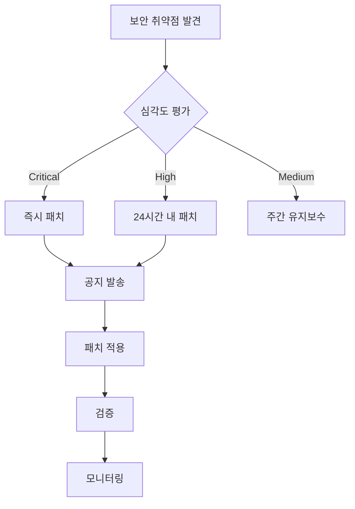

# YUANDI ERP - 유지보수 일정 및 가이드

## 📋 목차

1. [유지보수 개요](#유지보수-개요)
2. [정기 유지보수 일정](#정기-유지보수-일정)
3. [일일 점검](#일일-점검)
4. [주간 작업](#주간-작업)
5. [월간 작업](#월간-작업)
6. [분기별 작업](#분기별-작업)
7. [연간 작업](#연간-작업)
8. [긴급 유지보수](#긴급-유지보수)
9. [유지보수 체크리스트](#유지보수-체크리스트)
10. [도구 및 스크립트](#도구-및-스크립트)

---

## 🎯 유지보수 개요

### 목적
- 시스템 안정성 및 성능 유지
- 보안 취약점 조기 발견 및 해결
- 데이터 무결성 보장
- 비즈니스 연속성 확보

### 유지보수 원칙
1. **예방적 유지보수**: 문제 발생 전 조치
2. **최소 다운타임**: 서비스 영향 최소화
3. **문서화**: 모든 작업 기록
4. **자동화**: 반복 작업 자동화

### 유지보수 시간대
- **정기 유지보수**: 매주 일요일 03:00-05:00 KST
- **긴급 패치**: 필요시 즉시 (공지 후)
- **대규모 업데이트**: 분기별 계획 수립

---

## 📅 정기 유지보수 일정

### 2024년 연간 일정

| 월 | 1주 | 2주 | 3주 | 4주 | 주요 작업 |
|----|-----|-----|-----|-----|-----------|
| **1월** | 일반 | 보안패치 | 일반 | 백업테스트 | 연간 계획 수립 |
| **2월** | 일반 | 일반 | 성능최적화 | 일반 | 설 연휴 대비 |
| **3월** | 분기점검 | 일반 | 보안패치 | 일반 | Q1 리뷰 |
| **4월** | 일반 | 스프링클린 | 일반 | 백업테스트 | 시스템 정리 |
| **5월** | 일반 | 보안패치 | 일반 | 일반 | 부하테스트 |
| **6월** | 분기점검 | 일반 | 일반 | DR테스트 | Q2 리뷰 |
| **7월** | 일반 | 보안패치 | 성능최적화 | 일반 | 여름 대비 |
| **8월** | 일반 | 일반 | 일반 | 백업테스트 | 휴가철 대응 |
| **9월** | 분기점검 | 보안패치 | 일반 | 일반 | Q3 리뷰, 추석 대비 |
| **10월** | 일반 | 일반 | 연간감사 | 일반 | 보안 감사 |
| **11월** | 일반 | 보안패치 | 성능최적화 | 백업테스트 | 연말 준비 |
| **12월** | 분기점검 | 일반 | 일반 | 연간리뷰 | Q4 리뷰, 차년도 계획 |

### 유지보수 유형별 일정

| 유형 | 주기 | 소요시간 | 다운타임 | 담당 |
|------|------|----------|----------|------|
| 시스템 모니터링 | 실시간 | 상시 | 없음 | DevOps |
| 로그 점검 | 일일 | 30분 | 없음 | DevOps |
| 백업 실행 | 일일 | 2시간 | 없음 | 자동화 |
| 보안 패치 | 월 2회 | 2시간 | 30분 | Security |
| 성능 최적화 | 분기별 | 4시간 | 1시간 | Tech Lead |
| DR 테스트 | 반기별 | 8시간 | 2시간 | 전체팀 |

---

## 📍 일일 점검

### 오전 점검 (09:00)

#### 시스템 상태 확인
```bash
#!/bin/bash
# scripts/daily-morning-check.sh

echo "=== 일일 오전 점검 시작 ==="
date

# 1. 서비스 상태 확인
echo "1. 서비스 상태 확인"
curl -s https://yuandi.com/api/health | jq '.'

# 2. 리소스 사용률 확인
echo "2. 리소스 사용률"
vercel inspect yuandi-erp --metrics

# 3. 에러 로그 확인
echo "3. 최근 에러 (1시간)"
vercel logs --prod --since 1h | grep ERROR

# 4. 데이터베이스 연결 확인
echo "4. DB 연결 상태"
psql $DATABASE_URL -c "SELECT version();"

# 5. 백업 상태 확인
echo "5. 최근 백업"
aws s3 ls s3://yuandi-backups/ --recursive | tail -5

echo "=== 점검 완료 ==="
```

### 체크리스트
- [ ] 대시보드 모니터링 확인
- [ ] 알림 메시지 확인
- [ ] 전일 백업 성공 여부
- [ ] 디스크 사용률 (<80%)
- [ ] 메모리 사용률 (<90%)
- [ ] API 응답 시간 (<500ms)
- [ ] 에러율 (<1%)
- [ ] 큐 지연 확인

### 저녁 점검 (18:00)

#### 일일 리포트 생성
```bash
#!/bin/bash
# scripts/daily-report.sh

echo "=== 일일 리포트 ==="
date

# 오늘의 메트릭
echo "📊 오늘의 주요 지표"
echo "- 총 요청 수: $(curl -s $METRICS_API/requests/today)"
echo "- 평균 응답 시간: $(curl -s $METRICS_API/response-time/avg)"
echo "- 에러 발생: $(curl -s $METRICS_API/errors/count)"
echo "- 신규 주문: $(curl -s $API_URL/orders/today/count)"

# 이슈 사항
echo "⚠️ 이슈 사항"
# 자동으로 수집된 이슈 표시

# 내일 예정 작업
echo "📅 내일 예정"
# 캘린더 API에서 가져오기
```

---

## 📅 주간 작업

### 매주 일요일 03:00-05:00

#### 주간 유지보수 스크립트
```bash
#!/bin/bash
# scripts/weekly-maintenance.sh

set -e

echo "=== 주간 유지보수 시작 ==="
START_TIME=$(date +%s)

# 1. 로그 로테이션
echo "1. 로그 로테이션"
find /var/log/yuandi -name "*.log" -mtime +7 -exec gzip {} \;
find /var/log/yuandi -name "*.gz" -mtime +30 -delete

# 2. 임시 파일 정리
echo "2. 임시 파일 정리"
find /tmp -type f -mtime +7 -delete
rm -rf /var/cache/yuandi/temp/*

# 3. 데이터베이스 최적화
echo "3. DB 최적화"
psql $DATABASE_URL << EOF
VACUUM ANALYZE;
REINDEX DATABASE yuandi_prod;
EOF

# 4. 캐시 정리
echo "4. 캐시 갱신"
redis-cli FLUSHDB
curl -X POST https://yuandi.com/api/cache/warm-up

# 5. 보안 스캔
echo "5. 보안 스캔"
npm audit --production
trivy image yuandi-erp:latest

# 6. 백업 검증
echo "6. 백업 검증"
./scripts/verify-backup.sh

END_TIME=$(date +%s)
DURATION=$((END_TIME - START_TIME))
echo "=== 유지보수 완료 (소요시간: ${DURATION}초) ==="
```

### 주간 체크리스트
- [ ] 시스템 로그 검토
- [ ] 보안 이벤트 분석
- [ ] 성능 메트릭 리뷰
- [ ] 백업 무결성 검증
- [ ] 디스크 공간 정리
- [ ] 패치 계획 수립
- [ ] 다음 주 일정 확인

---

## 📅 월간 작업

### 매월 첫째 주 일요일

#### 월간 작업 목록

##### 1. 보안 업데이트
```bash
#!/bin/bash
# scripts/monthly-security-update.sh

# OS 패치
sudo apt update && sudo apt upgrade -y

# Node.js 패키지 업데이트
npm update
npm audit fix

# Docker 이미지 업데이트
docker pull node:20-alpine
docker system prune -a

# SSL 인증서 갱신 확인
certbot certificates
```

##### 2. 성능 분석
```sql
-- 느린 쿼리 분석
SELECT 
  query,
  calls,
  mean_exec_time,
  total_exec_time
FROM pg_stat_statements
WHERE mean_exec_time > 100
ORDER BY mean_exec_time DESC
LIMIT 20;

-- 인덱스 사용률
SELECT 
  schemaname,
  tablename,
  indexname,
  idx_scan,
  idx_tup_read,
  idx_tup_fetch
FROM pg_stat_user_indexes
ORDER BY idx_scan;
```

##### 3. 용량 계획
```bash
# 디스크 사용 추이
df -h | grep -E "Filesystem|yuandi"

# DB 크기 증가율
psql $DATABASE_URL -c "
SELECT 
  pg_database.datname,
  pg_size_pretty(pg_database_size(pg_database.datname)) AS size
FROM pg_database
ORDER BY pg_database_size(pg_database.datname) DESC;"

# 예상 용량 계산
./scripts/capacity-planning.sh
```

### 월간 리포트 템플릿

```markdown
# 월간 유지보수 리포트 - 2024년 8월

## 요약
- 가동률: 99.95%
- 총 다운타임: 21분
- 처리된 요청: 1,234,567
- 평균 응답시간: 145ms

## 주요 작업
1. 보안 패치 적용 (8/7, 8/21)
2. 데이터베이스 인덱스 최적화
3. 백업 시스템 개선

## 이슈 및 해결
| 날짜 | 이슈 | 해결방법 | 다운타임 |
|------|------|----------|----------|
| 8/15 | API 지연 | 캐시 서버 재시작 | 5분 |

## 다음 달 계획
- 대규모 DB 마이그레이션 (9/5)
- 로드밸런서 업그레이드
```

---

## 📅 분기별 작업

### 분기별 종합 점검 (3, 6, 9, 12월)

#### 1. 인프라 점검
- [ ] 하드웨어 상태 점검
- [ ] 네트워크 장비 점검
- [ ] 전원 시스템 점검
- [ ] 냉각 시스템 점검

#### 2. 보안 감사
```bash
#!/bin/bash
# scripts/quarterly-security-audit.sh

# 침투 테스트
./tools/pentest-suite.sh

# 접근 권한 검토
./scripts/access-review.sh

# 보안 정책 준수 확인
./scripts/compliance-check.sh

# 취약점 스캔
nessus -T pdf -o /reports/security-q3-2024.pdf
```

#### 3. 성능 최적화
- 데이터베이스 재구성
- 인덱스 재생성
- 쿼리 최적화
- 캐시 전략 검토

#### 4. DR 테스트
```bash
#!/bin/bash
# scripts/dr-test.sh

# 1. 백업에서 복구
./scripts/restore-to-staging.sh

# 2. 데이터 검증
./scripts/verify-data-integrity.sh

# 3. 기능 테스트
npm run test:e2e

# 4. 페일오버 테스트
./scripts/failover-test.sh
```

### 분기별 리뷰 미팅 아젠다
1. KPI 리뷰
2. 인시던트 분석
3. 개선 사항 논의
4. 다음 분기 계획

---

## 📅 연간 작업

### 연말 종합 점검 (12월)

#### 1. 연간 성과 분석
```python
# scripts/annual-analysis.py
import pandas as pd
import matplotlib.pyplot as plt

# 데이터 수집
metrics = collect_annual_metrics()

# 가동률 분석
uptime_report = analyze_uptime(metrics)
print(f"연간 가동률: {uptime_report['average']}%")

# 성능 추이
performance_trend = analyze_performance(metrics)
plot_trend(performance_trend)

# 비용 분석
cost_analysis = analyze_costs(metrics)
generate_cost_report(cost_analysis)
```

#### 2. 차년도 계획
- [ ] 인프라 업그레이드 계획
- [ ] 예산 수립
- [ ] 인력 계획
- [ ] 기술 로드맵 수립

#### 3. 라이선스 갱신
| 서비스 | 만료일 | 갱신일 | 비용 |
|--------|--------|--------|------|
| Vercel Pro | 2024-12-31 | 2024-12-01 | $240/year |
| Supabase Pro | 2024-12-31 | 2024-12-01 | $300/year |
| Sentry | 2025-01-15 | 2024-12-15 | $180/year |
| Domain | 2025-02-28 | 2025-01-31 | $15/year |

---

## 🚨 긴급 유지보수

### 긴급 패치 프로세스



### 긴급 패치 체크리스트
- [ ] 취약점 영향 분석
- [ ] 패치 테스트 (스테이징)
- [ ] 백업 실행
- [ ] 공지사항 작성
- [ ] 패치 적용
- [ ] 기능 검증
- [ ] 모니터링 강화
- [ ] 사후 리포트

### 공지 템플릿
```
[긴급 유지보수 공지]

안녕하세요, YUANDI 입니다.

보안 강화를 위한 긴급 유지보수를 진행합니다.

- 일시: 2024년 8월 23일 22:00 ~ 23:00 (1시간)
- 영향: 일시적 서비스 중단
- 사유: 보안 패치 적용

유지보수 중에는 서비스 이용이 제한될 수 있습니다.
고객님의 양해 부탁드립니다.

감사합니다.
```

---

## ✅ 유지보수 체크리스트

### 일일 체크리스트
```yaml
morning_check:
  - [ ] 시스템 상태 대시보드 확인
  - [ ] 알림 메시지 확인
  - [ ] 백업 성공 여부 확인
  - [ ] 리소스 사용률 확인
  - [ ] 에러 로그 검토

evening_check:
  - [ ] 일일 메트릭 기록
  - [ ] 이슈 사항 정리
  - [ ] 내일 일정 확인
  - [ ] 팀 공유사항 작성
```

### 주간 체크리스트
```yaml
weekly_maintenance:
  - [ ] 로그 로테이션
  - [ ] 임시 파일 정리
  - [ ] DB 최적화 실행
  - [ ] 캐시 정리
  - [ ] 보안 스캔 실행
  - [ ] 백업 검증
  - [ ] 주간 리포트 작성
```

### 월간 체크리스트
```yaml
monthly_tasks:
  - [ ] 보안 패치 적용
  - [ ] 성능 분석 리포트
  - [ ] 용량 계획 검토
  - [ ] 비용 분석
  - [ ] SLA 리뷰
  - [ ] 팀 미팅
```

---

## 🛠️ 도구 및 스크립트

### 자동화 스크립트

```bash
/scripts/maintenance/
├── daily/
│   ├── morning-check.sh
│   ├── evening-report.sh
│   └── backup-verify.sh
├── weekly/
│   ├── maintenance.sh
│   ├── log-rotation.sh
│   └── security-scan.sh
├── monthly/
│   ├── patch-update.sh
│   ├── performance-analysis.sh
│   └── capacity-planning.sh
├── quarterly/
│   ├── security-audit.sh
│   ├── dr-test.sh
│   └── optimization.sh
└── emergency/
    ├── quick-patch.sh
    ├── rollback.sh
    └── emergency-backup.sh
```

### 모니터링 도구

| 도구 | 용도 | URL |
|------|------|-----|
| Grafana | 메트릭 시각화 | https://grafana.yuandi.com |
| Prometheus | 메트릭 수집 | https://prometheus.yuandi.com |
| ELK Stack | 로그 분석 | https://elastic.yuandi.com |
| Sentry | 에러 추적 | https://sentry.io/yuandi |
| UptimeRobot | 가동시간 모니터링 | https://uptimerobot.com |

### 유틸리티 명령어

```bash
# 시스템 상태 확인
htop                          # CPU/메모리 실시간
iotop                         # 디스크 I/O 모니터링
nethogs                       # 네트워크 사용량
docker stats                  # 컨테이너 상태

# 데이터베이스 관리
psql $DATABASE_URL            # DB 접속
pg_dump                       # 백업
pg_restore                    # 복구
pgbench                       # 성능 테스트

# 로그 분석
tail -f /var/log/yuandi.log  # 실시간 로그
grep ERROR                    # 에러 검색
awk '{print $1}' | sort | uniq -c  # 패턴 분석

# 네트워크 진단
ping -c 4 yuandi.com          # 연결 확인
traceroute yuandi.com         # 경로 추적
nslookup yuandi.com           # DNS 조회
netstat -tuln                 # 포트 확인
```

---

## 📊 KPI 및 메트릭

### 핵심 성과 지표

| KPI | 목표 | 현재 | 상태 |
|-----|------|------|------|
| 가동률 | >99.9% | 99.95% | ✅ |
| 평균 복구 시간 | <30분 | 25분 | ✅ |
| 백업 성공률 | 100% | 100% | ✅ |
| 패치 적용 시간 | <7일 | 5일 | ✅ |
| 보안 사고 | 0건 | 0건 | ✅ |

### 월간 트렌드

```
가동률 추이 (%)
100 ┤
 99 ┤ ●━●━●━●━●━●
 98 ┤
 97 ┤
    └─┬─┬─┬─┬─┬─┬
      J F M A M J
```

---

## 📝 문서 및 참고 자료

### 내부 문서
- [시스템 아키텍처](./SYSTEM_ARCHITECTURE.md)
- [백업 및 복구](./BACKUP_RECOVERY.md)
- [인시던트 대응](./INCIDENT_RESPONSE.md)
- [보안 가이드](./SECURITY_GUIDE.md)

### 외부 리소스
- [Vercel 문서](https://vercel.com/docs)
- [Supabase 문서](https://supabase.com/docs)
- [PostgreSQL 관리](https://www.postgresql.org/docs/)
- [Docker 베스트 프랙티스](https://docs.docker.com/develop/dev-best-practices/)

### 연락처

| 역할 | 담당자 | 연락처 | 가용시간 |
|------|--------|--------|----------|
| DevOps Lead | 김개발 | 010-1234-5678 | 24/7 |
| DBA | 이디비 | 010-2345-6789 | 09:00-18:00 |
| Security | 박보안 | 010-3456-7890 | 24/7 긴급 |
| Vendor Support | Vercel | support@vercel.com | 24/7 |
| Vendor Support | Supabase | support@supabase.io | 24/7 |

---

최종 업데이트: 2024년 8월  
다음 리뷰: 2024년 9월  
버전: 1.0.0