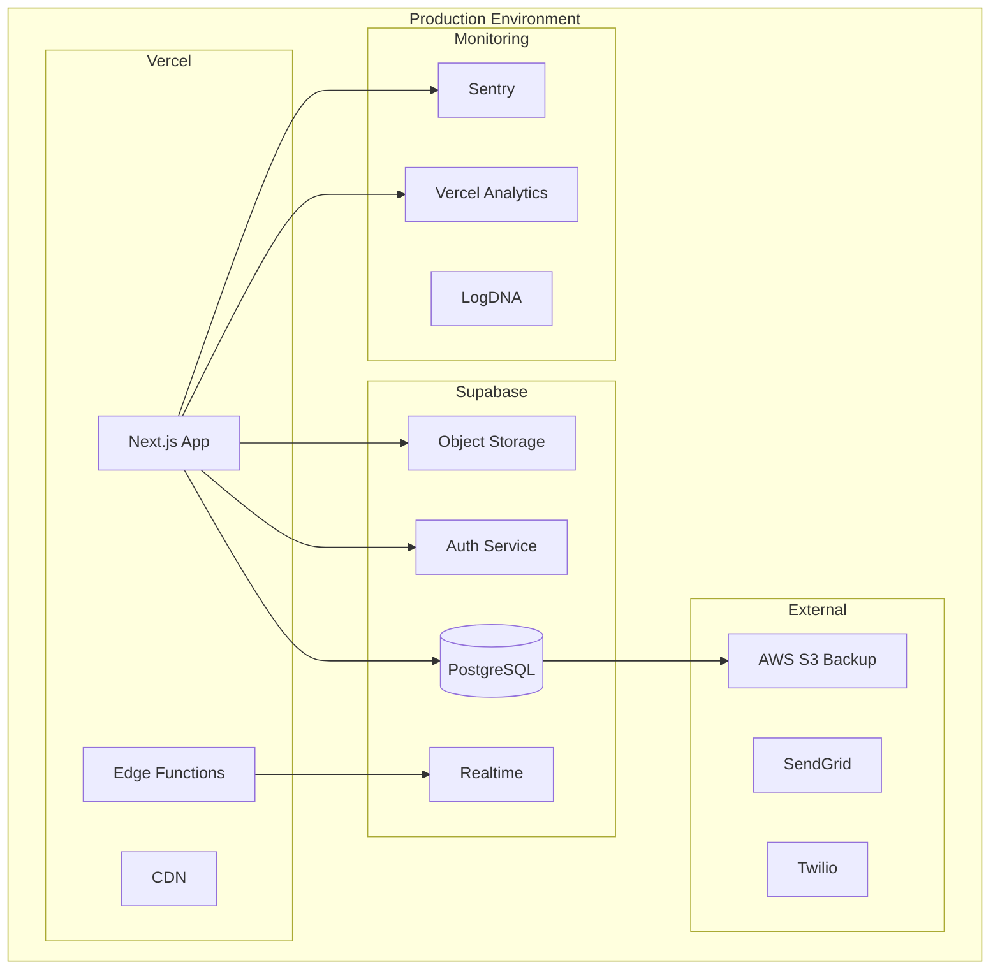

# YUANDI ERP - 프로덕션 환경 설정 가이드

## 📋 목차

1. [환경 구성 개요](#환경-구성-개요)
2. [Vercel 프로젝트 설정](#vercel-프로젝트-설정)
3. [Supabase 프로덕션 설정](#supabase-프로덕션-설정)
4. [환경 변수 구성](#환경-변수-구성)
5. [도메인 및 SSL 설정](#도메인-및-ssl-설정)
6. [보안 강화 설정](#보안-강화-설정)
7. [성능 최적화 설정](#성능-최적화-설정)
8. [백업 및 복구 설정](#백업-및-복구-설정)
9. [모니터링 통합](#모니터링-통합)
10. [배포 파이프라인](#배포-파이프라인)

---

## 🎯 환경 구성 개요

### 인프라 아키텍처



### 환경별 구성

| 구성 요소 | Development | Staging | Production |
|----------|-------------|---------|------------|
| **URL** | localhost:3000 | staging.yuandi.com | yuandi.com |
| **Supabase** | Free tier | Pro tier | Pro tier |
| **Vercel** | Hobby | Pro | Pro |
| **백업** | 없음 | 일간 | 실시간 + 일간 |
| **모니터링** | 기본 | 확장 | 전체 |
| **알림** | 없음 | 이메일 | 이메일 + SMS |

---

## 🚀 Vercel 프로젝트 설정

### 1. Vercel 프로젝트 생성

```bash
# Vercel CLI 설치
npm i -g vercel

# 프로젝트 연결
vercel link

# 프로젝트 설정
vercel project yuandi-erp
```

### 2. 프로젝트 설정 (vercel.json)

```json
{
  "name": "yuandi-erp",
  "framework": "nextjs",
  "buildCommand": "npm run build",
  "outputDirectory": ".next",
  "devCommand": "npm run dev",
  "installCommand": "npm install",
  "regions": ["icn1"],
  "env": {
    "NODE_ENV": "production"
  },
  "build": {
    "env": {
      "NEXT_PUBLIC_SUPABASE_URL": "@supabase_url",
      "NEXT_PUBLIC_SUPABASE_ANON_KEY": "@supabase_anon_key",
      "SUPABASE_SERVICE_KEY": "@supabase_service_key"
    }
  },
  "functions": {
    "app/api/export/*.ts": {
      "maxDuration": 60
    },
    "app/api/backup/*.ts": {
      "maxDuration": 300,
      "memory": 3008
    }
  },
  "headers": [
    {
      "source": "/(.*)",
      "headers": [
        {
          "key": "X-Content-Type-Options",
          "value": "nosniff"
        },
        {
          "key": "X-Frame-Options",
          "value": "DENY"
        },
        {
          "key": "X-XSS-Protection",
          "value": "1; mode=block"
        }
      ]
    }
  ],
  "rewrites": [
    {
      "source": "/api/:path*",
      "destination": "/api/:path*"
    }
  ],
  "redirects": [
    {
      "source": "/admin",
      "destination": "/dashboard",
      "permanent": false
    }
  ]
}
```

### 3. 빌드 최적화 설정

```javascript
// next.config.js
/** @type {import('next').NextConfig} */
const nextConfig = {
  reactStrictMode: true,
  swcMinify: true,
  poweredByHeader: false,
  compress: true,
  
  // 이미지 최적화
  images: {
    domains: ['yuandi-storage.supabase.co'],
    formats: ['image/avif', 'image/webp'],
    minimumCacheTTL: 60 * 60 * 24 * 30, // 30 days
  },
  
  // 번들 최적화
  experimental: {
    optimizeCss: true,
    optimizePackageImports: [
      '@supabase/supabase-js',
      '@tanstack/react-query',
      'date-fns',
      'recharts'
    ]
  },
  
  // 보안 헤더
  async headers() {
    return [
      {
        source: '/:path*',
        headers: [
          {
            key: 'Strict-Transport-Security',
            value: 'max-age=63072000; includeSubDomains; preload'
          },
          {
            key: 'Content-Security-Policy',
            value: ContentSecurityPolicy.replace(/\s{2,}/g, ' ').trim()
          }
        ]
      }
    ]
  }
}

const ContentSecurityPolicy = `
  default-src 'self';
  script-src 'self' 'unsafe-eval' 'unsafe-inline' *.vercel.com;
  style-src 'self' 'unsafe-inline';
  img-src 'self' blob: data: *.supabase.co;
  font-src 'self' data:;
  connect-src 'self' *.supabase.co *.vercel.com;
  frame-ancestors 'none';
`

module.exports = nextConfig
```

---

## 🗄️ Supabase 프로덕션 설정

### 1. 프로젝트 생성

```bash
# Supabase CLI 설치
npm install -g supabase

# 프로젝트 초기화
supabase init

# 프로젝트 연결
supabase link --project-ref yuandi-erp-prod
```

### 2. 데이터베이스 스키마 배포

```sql
-- migrations/001_initial_schema.sql
-- 데이터베이스 초기 스키마

-- Enable extensions
CREATE EXTENSION IF NOT EXISTS "uuid-ossp";
CREATE EXTENSION IF NOT EXISTS "pg_trgm";
CREATE EXTENSION IF NOT EXISTS "btree_gin";

-- Set timezone
SET timezone = 'Asia/Seoul';

-- Create schemas
CREATE SCHEMA IF NOT EXISTS public;
CREATE SCHEMA IF NOT EXISTS auth;
CREATE SCHEMA IF NOT EXISTS storage;

-- Create custom types
CREATE TYPE order_status AS ENUM (
  'PENDING', 'PAID', 'SHIPPED', 'DONE', 'CANCELLED', 'REFUNDED'
);

CREATE TYPE user_role AS ENUM (
  'Admin', 'OrderManager', 'ShipManager', 'Customer'
);

CREATE TYPE transaction_type AS ENUM (
  'INCOME', 'EXPENSE'
);

-- Deploy migrations
-- (기존 스키마 파일 내용)
```

### 3. RLS (Row Level Security) 정책

```sql
-- migrations/002_rls_policies.sql

-- Enable RLS on all tables
ALTER TABLE profiles ENABLE ROW LEVEL SECURITY;
ALTER TABLE products ENABLE ROW LEVEL SECURITY;
ALTER TABLE orders ENABLE ROW LEVEL SECURITY;
ALTER TABLE order_items ENABLE ROW LEVEL SECURITY;
ALTER TABLE inventory_movements ENABLE ROW LEVEL SECURITY;
ALTER TABLE shipments ENABLE ROW LEVEL SECURITY;
ALTER TABLE cashbook ENABLE ROW LEVEL SECURITY;

-- Admin full access
CREATE POLICY "Admin full access on profiles"
  ON profiles FOR ALL
  USING (auth.uid() IN (
    SELECT id FROM profiles WHERE role = 'Admin'
  ));

-- OrderManager policies
CREATE POLICY "OrderManager read orders"
  ON orders FOR SELECT
  USING (auth.uid() IN (
    SELECT id FROM profiles 
    WHERE role IN ('Admin', 'OrderManager')
  ));

CREATE POLICY "OrderManager create orders"
  ON orders FOR INSERT
  WITH CHECK (auth.uid() IN (
    SELECT id FROM profiles 
    WHERE role IN ('Admin', 'OrderManager')
  ));

-- Customer portal access
CREATE POLICY "Customer view own orders"
  ON orders FOR SELECT
  USING (
    auth.uid() IS NULL AND 
    customer_phone = current_setting('request.customer_phone', true)
  );

-- Audit trail
CREATE POLICY "Insert only audit logs"
  ON event_logs FOR INSERT
  WITH CHECK (true);

CREATE POLICY "Admin read audit logs"
  ON event_logs FOR SELECT
  USING (auth.uid() IN (
    SELECT id FROM profiles WHERE role = 'Admin'
  ));
```

### 4. 실시간 구독 설정

```sql
-- Enable realtime
ALTER PUBLICATION supabase_realtime ADD TABLE orders;
ALTER PUBLICATION supabase_realtime ADD TABLE inventory_movements;
ALTER PUBLICATION supabase_realtime ADD TABLE shipments;

-- Configure realtime filters
CREATE OR REPLACE FUNCTION broadcast_order_update()
RETURNS TRIGGER AS $$
BEGIN
  PERFORM pg_notify(
    'order_updates',
    json_build_object(
      'id', NEW.id,
      'order_no', NEW.order_no,
      'status', NEW.status,
      'updated_at', NEW.updated_at
    )::text
  );
  RETURN NEW;
END;
$$ LANGUAGE plpgsql;

CREATE TRIGGER order_update_broadcast
AFTER UPDATE ON orders
FOR EACH ROW
EXECUTE FUNCTION broadcast_order_update();
```

### 5. 백업 설정

```bash
# 백업 정책 설정
supabase db remote commit -m "Enable point-in-time recovery"

# 자동 백업 스케줄 (cron)
0 3 * * * supabase db dump -f /backups/yuandi_$(date +\%Y\%m\%d).sql

# S3 업로드
0 4 * * * aws s3 cp /backups/yuandi_$(date +\%Y\%m\%d).sql s3://yuandi-backups/
```

---

## 🔐 환경 변수 구성

### 1. Vercel 환경 변수

```bash
# Vercel Dashboard 또는 CLI로 설정

# Supabase
vercel env add NEXT_PUBLIC_SUPABASE_URL production
vercel env add NEXT_PUBLIC_SUPABASE_ANON_KEY production
vercel env add SUPABASE_SERVICE_KEY production

# 외부 서비스
vercel env add SENDGRID_API_KEY production
vercel env add TWILIO_ACCOUNT_SID production
vercel env add TWILIO_AUTH_TOKEN production
vercel env add AWS_ACCESS_KEY_ID production
vercel env add AWS_SECRET_ACCESS_KEY production

# 보안
vercel env add JWT_SECRET production
vercel env add ENCRYPTION_KEY production
vercel env add WEBHOOK_SECRET production

# 모니터링
vercel env add SENTRY_DSN production
vercel env add VERCEL_ANALYTICS_ID production
vercel env add LOGDNA_KEY production

# 기타
vercel env add CRON_SECRET production
vercel env add ADMIN_EMAIL production
```

### 2. 환경 변수 검증 스크립트

```javascript
// scripts/validate-env.js
const required = [
  'NEXT_PUBLIC_SUPABASE_URL',
  'NEXT_PUBLIC_SUPABASE_ANON_KEY',
  'SUPABASE_SERVICE_KEY',
  'JWT_SECRET',
  'ENCRYPTION_KEY'
];

const missing = required.filter(key => !process.env[key]);

if (missing.length > 0) {
  console.error('Missing required environment variables:');
  missing.forEach(key => console.error(`  - ${key}`));
  process.exit(1);
}

console.log('✅ All required environment variables are set');
```

---

## 🌐 도메인 및 SSL 설정

### 1. 도메인 구성

```bash
# Vercel에 도메인 추가
vercel domains add yuandi.com

# DNS 레코드 설정
A     @       76.76.21.21
CNAME www     cname.vercel-dns.com
CNAME staging staging.vercel-dns.com

# SSL 인증서 자동 발급
vercel certs
```

### 2. 서브도메인 라우팅

```javascript
// middleware.ts
import { NextResponse } from 'next/server'
import type { NextRequest } from 'next/server'

export function middleware(request: NextRequest) {
  const hostname = request.headers.get('host')
  
  // API 서브도메인
  if (hostname?.startsWith('api.')) {
    return NextResponse.rewrite(
      new URL('/api' + request.nextUrl.pathname, request.url)
    )
  }
  
  // 관리자 서브도메인
  if (hostname?.startsWith('admin.')) {
    return NextResponse.rewrite(
      new URL('/admin' + request.nextUrl.pathname, request.url)
    )
  }
  
  // 고객 포털 서브도메인
  if (hostname?.startsWith('track.')) {
    return NextResponse.rewrite(
      new URL('/track', request.url)
    )
  }
  
  return NextResponse.next()
}
```

---

## 🛡️ 보안 강화 설정

### 1. API Rate Limiting

```typescript
// lib/rate-limit.ts
import { Ratelimit } from '@upstash/ratelimit'
import { Redis } from '@upstash/redis'

const redis = new Redis({
  url: process.env.UPSTASH_REDIS_REST_URL!,
  token: process.env.UPSTASH_REDIS_REST_TOKEN!,
})

export const rateLimiter = {
  api: new Ratelimit({
    redis,
    limiter: Ratelimit.slidingWindow(1000, '1 h'),
    analytics: true,
  }),
  
  auth: new Ratelimit({
    redis,
    limiter: Ratelimit.slidingWindow(5, '15 m'),
    analytics: true,
  }),
  
  customerPortal: new Ratelimit({
    redis,
    limiter: Ratelimit.slidingWindow(100, '1 h'),
    analytics: true,
  }),
}
```

### 2. WAF 규칙

```javascript
// vercel.json
{
  "functions": {
    "app/api/*": {
      "waf": {
        "rules": [
          {
            "id": "block-sql-injection",
            "expression": "http.request.uri.query contains \"union\" or http.request.uri.query contains \"select\"",
            "action": "block"
          },
          {
            "id": "block-xss",
            "expression": "http.request.uri.query contains \"<script\"",
            "action": "block"
          },
          {
            "id": "rate-limit-api",
            "expression": "rate(1000, 1h)",
            "action": "challenge"
          }
        ]
      }
    }
  }
}
```

### 3. 보안 미들웨어

```typescript
// middleware/security.ts
import { NextRequest, NextResponse } from 'next/server'
import { verify } from 'jsonwebtoken'
import { rateLimiter } from '@/lib/rate-limit'

export async function securityMiddleware(req: NextRequest) {
  // CSRF 보호
  if (['POST', 'PUT', 'PATCH', 'DELETE'].includes(req.method)) {
    const csrfToken = req.headers.get('x-csrf-token')
    if (!csrfToken || !validateCSRFToken(csrfToken)) {
      return new NextResponse('Invalid CSRF token', { status: 403 })
    }
  }
  
  // Rate limiting
  const identifier = req.ip ?? 'anonymous'
  const { success, limit, reset, remaining } = await rateLimiter.api.limit(identifier)
  
  if (!success) {
    return new NextResponse('Too many requests', {
      status: 429,
      headers: {
        'X-RateLimit-Limit': limit.toString(),
        'X-RateLimit-Remaining': remaining.toString(),
        'X-RateLimit-Reset': new Date(reset).toISOString(),
      },
    })
  }
  
  // JWT 검증
  const token = req.headers.get('authorization')?.replace('Bearer ', '')
  if (token) {
    try {
      const decoded = verify(token, process.env.JWT_SECRET!)
      // @ts-ignore
      req.user = decoded
    } catch (error) {
      return new NextResponse('Invalid token', { status: 401 })
    }
  }
  
  return NextResponse.next()
}
```

---

## ⚡ 성능 최적화 설정

### 1. 캐싱 전략

```typescript
// lib/cache.ts
import { unstable_cache } from 'next/cache'

export const cachedGetProducts = unstable_cache(
  async () => {
    return await getProducts()
  },
  ['products'],
  {
    revalidate: 60 * 5, // 5분
    tags: ['products']
  }
)

export const cachedGetDashboard = unstable_cache(
  async (userId: string) => {
    return await getDashboardData(userId)
  },
  ['dashboard'],
  {
    revalidate: 60, // 1분
    tags: ['dashboard']
  }
)

// 캐시 무효화
export async function invalidateCache(tags: string[]) {
  await fetch('/api/revalidate', {
    method: 'POST',
    body: JSON.stringify({ tags }),
  })
}
```

### 2. 데이터베이스 최적화

```sql
-- 인덱스 생성
CREATE INDEX idx_orders_status_date ON orders(status, created_at DESC);
CREATE INDEX idx_orders_customer ON orders(customer_phone, customer_name);
CREATE INDEX idx_products_sku ON products(sku);
CREATE INDEX idx_inventory_product ON inventory_movements(product_id, created_at DESC);

-- 파티셔닝 (월별)
CREATE TABLE orders_2024_08 PARTITION OF orders
  FOR VALUES FROM ('2024-08-01') TO ('2024-09-01');
  
CREATE TABLE orders_2024_09 PARTITION OF orders
  FOR VALUES FROM ('2024-09-01') TO ('2024-10-01');

-- Vacuum 및 Analyze
VACUUM ANALYZE orders;
VACUUM ANALYZE products;
VACUUM ANALYZE inventory_movements;

-- Connection pooling 설정
ALTER DATABASE yuandi_prod SET 
  max_connections = 100,
  shared_buffers = '256MB',
  effective_cache_size = '1GB';
```

### 3. CDN 설정

```javascript
// next.config.js
module.exports = {
  assetPrefix: process.env.NODE_ENV === 'production' 
    ? 'https://cdn.yuandi.com' 
    : '',
  
  // 정적 자산 최적화
  staticPageGenerationTimeout: 60,
  
  // ISR 설정
  experimental: {
    isrMemoryCacheSize: 0, // 비활성화 (Vercel이 관리)
  },
}
```

---

## 💾 백업 및 복구 설정

### 1. 자동 백업 스크립트

```bash
#!/bin/bash
# scripts/backup-production.sh

set -e

# 환경 변수
BACKUP_DIR="/var/backups/yuandi"
S3_BUCKET="s3://yuandi-backups"
DATE=$(date +%Y%m%d_%H%M%S)
RETENTION_DAYS=30

# 데이터베이스 백업
echo "Starting database backup..."
pg_dump $DATABASE_URL > $BACKUP_DIR/db_$DATE.sql

# 압축
gzip $BACKUP_DIR/db_$DATE.sql

# S3 업로드
aws s3 cp $BACKUP_DIR/db_$DATE.sql.gz $S3_BUCKET/database/

# Storage 백업
echo "Starting storage backup..."
supabase storage download --recursive / $BACKUP_DIR/storage_$DATE/
tar -czf $BACKUP_DIR/storage_$DATE.tar.gz $BACKUP_DIR/storage_$DATE/
aws s3 cp $BACKUP_DIR/storage_$DATE.tar.gz $S3_BUCKET/storage/

# 오래된 백업 삭제
find $BACKUP_DIR -name "*.gz" -mtime +$RETENTION_DAYS -delete
aws s3 ls $S3_BUCKET/ --recursive | awk '{print $4}' | \
  xargs -I {} aws s3 rm $S3_BUCKET/{} --if-modified-before $(date -d "$RETENTION_DAYS days ago" +%Y-%m-%d)

echo "Backup completed successfully"
```

### 2. 복구 절차

```bash
#!/bin/bash
# scripts/restore-production.sh

set -e

# 복구할 백업 선택
BACKUP_DATE=$1
if [ -z "$BACKUP_DATE" ]; then
  echo "Usage: ./restore-production.sh YYYYMMDD_HHMMSS"
  exit 1
fi

# 백업 다운로드
aws s3 cp s3://yuandi-backups/database/db_$BACKUP_DATE.sql.gz /tmp/
aws s3 cp s3://yuandi-backups/storage/storage_$BACKUP_DATE.tar.gz /tmp/

# 압축 해제
gunzip /tmp/db_$BACKUP_DATE.sql.gz
tar -xzf /tmp/storage_$BACKUP_DATE.tar.gz -C /tmp/

# 데이터베이스 복구
echo "Restoring database..."
psql $DATABASE_URL < /tmp/db_$BACKUP_DATE.sql

# Storage 복구
echo "Restoring storage..."
supabase storage upload --recursive /tmp/storage_$BACKUP_DATE/ /

echo "Restore completed successfully"
```

---

## 📊 모니터링 통합

### 1. Vercel Analytics 설정

```typescript
// app/layout.tsx
import { Analytics } from '@vercel/analytics/react'
import { SpeedInsights } from '@vercel/speed-insights/next'

export default function RootLayout({
  children,
}: {
  children: React.ReactNode
}) {
  return (
    <html lang="ko">
      <body>
        {children}
        <Analytics />
        <SpeedInsights />
      </body>
    </html>
  )
}
```

### 2. Sentry 설정

```javascript
// sentry.client.config.ts
import * as Sentry from '@sentry/nextjs'

Sentry.init({
  dsn: process.env.NEXT_PUBLIC_SENTRY_DSN,
  tracesSampleRate: 0.1,
  debug: false,
  replaysOnErrorSampleRate: 1.0,
  replaysSessionSampleRate: 0.1,
  
  integrations: [
    new Sentry.Replay({
      maskAllText: true,
      blockAllMedia: true,
    }),
  ],
  
  beforeSend(event, hint) {
    // PII 필터링
    if (event.user) {
      delete event.user.email
      delete event.user.ip_address
    }
    return event
  },
})
```

### 3. 커스텀 메트릭

```typescript
// lib/metrics.ts
export function trackMetric(name: string, value: number, tags?: Record<string, string>) {
  if (typeof window !== 'undefined' && window.analytics) {
    window.analytics.track('metric', {
      metric_name: name,
      metric_value: value,
      ...tags,
    })
  }
}

// 사용 예
trackMetric('order_created', 1, { 
  payment_method: 'card',
  total_amount: order.total_amount 
})

trackMetric('api_response_time', responseTime, {
  endpoint: '/api/orders',
  method: 'GET'
})
```

---

## 🚀 배포 파이프라인

### 1. GitHub Actions CI/CD

```yaml
# .github/workflows/deploy-production.yml
name: Deploy to Production

on:
  push:
    branches: [main]
  workflow_dispatch:

jobs:
  test:
    runs-on: ubuntu-latest
    steps:
      - uses: actions/checkout@v3
      
      - name: Setup Node.js
        uses: actions/setup-node@v3
        with:
          node-version: '20'
          cache: 'npm'
      
      - name: Install dependencies
        run: npm ci
      
      - name: Run tests
        run: npm test
      
      - name: Run E2E tests
        run: npm run test:e2e
      
      - name: Type check
        run: npm run typecheck
      
      - name: Lint
        run: npm run lint

  deploy:
    needs: test
    runs-on: ubuntu-latest
    environment: production
    
    steps:
      - uses: actions/checkout@v3
      
      - name: Deploy to Vercel
        uses: amondnet/vercel-action@v25
        with:
          vercel-token: ${{ secrets.VERCEL_TOKEN }}
          vercel-org-id: ${{ secrets.VERCEL_ORG_ID }}
          vercel-project-id: ${{ secrets.VERCEL_PROJECT_ID }}
          vercel-args: '--prod'
      
      - name: Run deployment validation
        run: |
          chmod +x scripts/validate-deployment.sh
          PRODUCTION_URL=https://yuandi.com ./scripts/validate-deployment.sh
      
      - name: Notify deployment
        uses: 8398a7/action-slack@v3
        with:
          status: ${{ job.status }}
          text: 'Production deployment completed'
          webhook_url: ${{ secrets.SLACK_WEBHOOK }}
```

### 2. 롤백 절차

```bash
#!/bin/bash
# scripts/rollback.sh

# 이전 배포 버전으로 롤백
vercel rollback

# 또는 특정 배포 ID로 롤백
vercel promote [deployment-id]

# 데이터베이스 마이그레이션 롤백
supabase migration revert

# 캐시 초기화
vercel env rm FORCE_CACHE_REFRESH
vercel env add FORCE_CACHE_REFRESH true

# 모니터링 알림
curl -X POST $SLACK_WEBHOOK \
  -H 'Content-Type: application/json' \
  -d '{"text":"⚠️ Production rollback initiated"}'
```

---

## 📝 체크리스트

### 배포 전 체크리스트

- [ ] 모든 환경 변수 설정 완료
- [ ] 데이터베이스 마이그레이션 실행
- [ ] RLS 정책 적용
- [ ] SSL 인증서 발급
- [ ] 도메인 DNS 설정
- [ ] 백업 스케줄 설정
- [ ] 모니터링 통합 확인
- [ ] Rate limiting 설정
- [ ] 보안 헤더 구성
- [ ] 성능 최적화 적용

### 배포 후 체크리스트

- [ ] 배포 검증 스크립트 실행
- [ ] 주요 기능 수동 테스트
- [ ] 모니터링 대시보드 확인
- [ ] 에러 로그 확인
- [ ] 성능 메트릭 확인
- [ ] 백업 작동 확인
- [ ] 알림 시스템 테스트
- [ ] 고객 포털 접근 테스트
- [ ] API 엔드포인트 응답 확인
- [ ] 실시간 기능 작동 확인

---

## 🆘 트러블슈팅

### 일반적인 문제 해결

#### 1. 빌드 실패
```bash
# 캐시 삭제 후 재빌드
rm -rf .next node_modules
npm install
npm run build
```

#### 2. 환경 변수 오류
```bash
# 환경 변수 확인
vercel env ls production
vercel env pull .env.production
```

#### 3. 데이터베이스 연결 실패
```bash
# 연결 문자열 확인
supabase db remote show
# Connection pooler 사용
DATABASE_URL=postgresql://...?pgbouncer=true
```

#### 4. 성능 문제
```bash
# 캐시 초기화
vercel env add REVALIDATE_CACHE true
# CDN 캐시 제거
curl -X PURGE https://cdn.yuandi.com/*
```

---

최종 업데이트: 2024년 8월