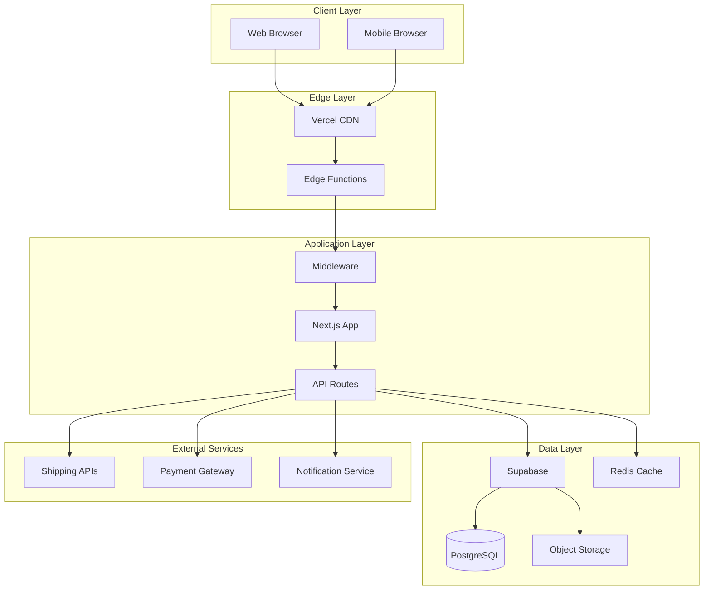
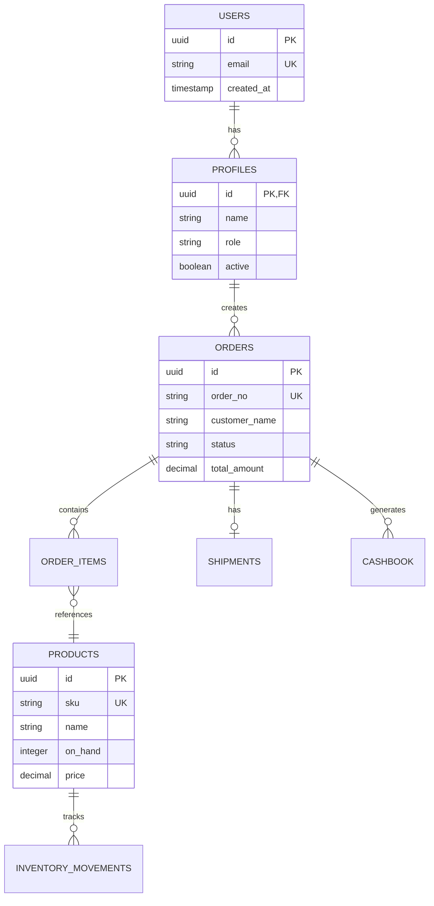
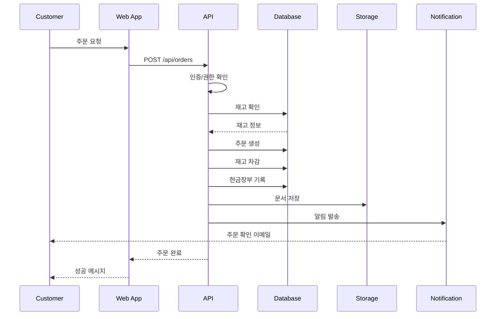

# YUANDI ERP - 시스템 아키텍처 문서

## 📋 목차
1. [시스템 개요](#시스템-개요)
2. [기술 스택](#기술-스택)
3. [아키텍처 다이어그램](#아키텍처-다이어그램)
4. [컴포넌트 상세](#컴포넌트-상세)
5. [데이터 흐름](#데이터-흐름)
6. [보안 아키텍처](#보안-아키텍처)
7. [확장성 전략](#확장성-전략)

---

## 🎯 시스템 개요

### 비즈니스 목표
YUANDI ERP는 해외 구매대행 비즈니스를 위한 통합 관리 시스템으로, 주문 관리부터 재고 관리, 배송 추적까지 전체 비즈니스 프로세스를 자동화합니다.

### 핵심 가치
- **효율성**: 수동 작업 90% 감소
- **정확성**: 인적 오류 최소화
- **실시간성**: 즉각적인 데이터 업데이트
- **확장성**: 비즈니스 성장 지원

### 시스템 특징
- 🌐 **다국어 지원**: 한국어/중국어
- 📱 **반응형 디자인**: PC/모바일 최적화
- 🔒 **보안**: 역할 기반 접근 제어
- ⚡ **성능**: 3초 이내 페이지 로드
- 🔄 **실시간 동기화**: 재고/주문 상태

---

## 🛠️ 기술 스택

### Frontend
```yaml
Framework: Next.js 14 (App Router)
Language: TypeScript 5.0
Styling: Tailwind CSS 3.4
UI Components: shadcn/ui
State Management: React Query (TanStack Query)
Forms: React Hook Form + Zod
Charts: Recharts
Icons: Lucide React
```

### Backend
```yaml
Runtime: Node.js 20 LTS
API: Next.js API Routes
Database: PostgreSQL 15 (Supabase)
Authentication: Supabase Auth
Storage: Supabase Storage
Realtime: Supabase Realtime
ORM: Supabase Client SDK
```

### Infrastructure
```yaml
Hosting: Vercel
CDN: Vercel Edge Network
Database: Supabase Cloud
Monitoring: Vercel Analytics
Error Tracking: Sentry
CI/CD: GitHub Actions + Vercel
```

### Development Tools
```yaml
Package Manager: npm 9
Build Tool: Next.js + SWC
Type Checking: TypeScript
Linting: ESLint
Formatting: Prettier
Testing: Jest + React Testing Library
E2E Testing: Playwright
```

---

## 🏗️ 아키텍처 다이어그램

### 전체 시스템 아키텍처


### 데이터베이스 스키마


---

## 🔧 컴포넌트 상세

### 1. Frontend Components

#### 페이지 구조
```
app/
├── (auth)/
│   ├── login/          # 로그인
│   └── register/       # 회원가입
├── (dashboard)/
│   ├── dashboard/      # 대시보드
│   ├── orders/         # 주문 관리
│   ├── products/       # 상품 관리
│   ├── inventory/      # 재고 관리
│   ├── shipments/      # 배송 관리
│   ├── cashbook/       # 현금장부
│   ├── users/          # 사용자 관리
│   └── settings/       # 설정
├── track/              # 고객 포털
└── api/                # API Routes
```

#### 컴포넌트 계층
```typescript
// 1. Layout Components
<RootLayout>
  <Providers>           // React Query, Theme
    <AuthProvider>      // Authentication Context
      <Navigation>      // Main Navigation
      <PageLayout>      // Page-specific Layout
        <Content>       // Page Content
      </PageLayout>
    </AuthProvider>
  </Providers>
</RootLayout>

// 2. Feature Components
<OrderList>             // 주문 목록
  <OrderFilter>         // 필터링
  <OrderTable>          // 테이블
    <OrderRow>          // 행
      <OrderActions>    // 액션 버튼
    </OrderRow>
  </OrderTable>
  <OrderPagination>     // 페이지네이션
</OrderList>

// 3. UI Components (shadcn/ui)
- Button, Card, Dialog, Input
- Select, Table, Tabs, Toast
- Form, Label, Badge, Alert
```

### 2. Backend Services

#### API 엔드포인트 구조
```typescript
// app/api/[resource]/route.ts
export async function GET(request: NextRequest) {
  // 1. 인증 확인
  const session = await getSession()
  if (!session) return unauthorized()
  
  // 2. 권한 확인
  if (!hasPermission(session.user, 'read:resource')) {
    return forbidden()
  }
  
  // 3. 데이터 조회
  const data = await supabase
    .from('resource')
    .select('*')
    .order('created_at', { ascending: false })
  
  // 4. 응답
  return NextResponse.json(data)
}
```

#### 비즈니스 로직 레이어
```typescript
// lib/domain/services/
├── OrderService.ts       // 주문 처리 로직
├── InventoryService.ts   // 재고 관리 로직
├── ShippingService.ts    // 배송 처리 로직
├── CashbookService.ts    // 금융 거래 로직
└── NotificationService.ts // 알림 서비스
```

### 3. Database Layer

#### RLS (Row Level Security) 정책
```sql
-- 역할별 접근 제어
CREATE POLICY "Admin full access" ON orders
  FOR ALL USING (auth.user_role() = 'Admin');

CREATE POLICY "OrderManager read orders" ON orders
  FOR SELECT USING (auth.user_role() IN ('Admin', 'OrderManager'));

CREATE POLICY "Customer read own orders" ON orders
  FOR SELECT USING (
    auth.uid() IS NULL AND 
    customer_phone = current_setting('request.customer_phone')
  );
```

#### 트리거 및 함수
```sql
-- 자동 주문번호 생성
CREATE OR REPLACE FUNCTION generate_order_number()
RETURNS TRIGGER AS $$
BEGIN
  NEW.order_no := 'ORD-' || 
    TO_CHAR(NOW(), 'YYMMDD') || '-' ||
    LPAD(nextval('order_seq')::TEXT, 3, '0');
  RETURN NEW;
END;
$$ LANGUAGE plpgsql;

-- 재고 차감 트리거
CREATE TRIGGER deduct_inventory
  AFTER INSERT ON order_items
  FOR EACH ROW
  EXECUTE FUNCTION update_product_inventory();
```

---

## 🔄 데이터 흐름

### 주문 처리 플로우


### 실시간 데이터 동기화
```typescript
// Supabase Realtime 구독
const subscription = supabase
  .channel('orders')
  .on('postgres_changes', {
    event: '*',
    schema: 'public',
    table: 'orders'
  }, (payload) => {
    // 실시간 업데이트 처리
    if (payload.eventType === 'INSERT') {
      addNewOrder(payload.new)
    } else if (payload.eventType === 'UPDATE') {
      updateOrder(payload.new)
    }
  })
  .subscribe()
```

---

## 🔐 보안 아키텍처

### 계층별 보안

#### 1. Network Layer
- **HTTPS 강제**: 모든 통신 암호화
- **Rate Limiting**: DDoS 방어
- **WAF**: Web Application Firewall
- **CORS**: Cross-Origin 정책

#### 2. Application Layer
- **인증**: Supabase Auth (JWT)
- **인가**: RBAC (역할 기반 접근 제어)
- **세션 관리**: Secure Cookie
- **CSRF 보호**: Token 검증

#### 3. Data Layer
- **암호화**: At-rest & In-transit
- **RLS**: Row Level Security
- **감사 로그**: 모든 변경 추적
- **백업**: 자동화된 백업

### 보안 체크리스트
```yaml
Authentication:
  ✅ Multi-factor Authentication (MFA)
  ✅ Password Policy Enforcement
  ✅ Session Timeout
  ✅ Account Lockout

Authorization:
  ✅ Role-Based Access Control
  ✅ Principle of Least Privilege
  ✅ API Key Management
  ✅ Token Rotation

Data Protection:
  ✅ Encryption (AES-256)
  ✅ PII Masking
  ✅ Secure Backup
  ✅ Data Retention Policy

Monitoring:
  ✅ Security Event Logging
  ✅ Anomaly Detection
  ✅ Real-time Alerts
  ✅ Audit Trail
```

---

## 📈 확장성 전략

### 수평 확장 (Horizontal Scaling)

#### 1. 애플리케이션 레이어
```yaml
Vercel Edge Functions:
  - Auto-scaling: 0 to ∞
  - Region: 전 세계 엣지 로케이션
  - Cold Start: < 50ms
  - Max Duration: 30s

Load Balancing:
  - Geographic Distribution
  - Health Check
  - Automatic Failover
```

#### 2. 데이터베이스 레이어
```yaml
Supabase PostgreSQL:
  - Read Replicas: 복제본 추가
  - Connection Pooling: PgBouncer
  - Partitioning: 테이블 파티셔닝
  - Sharding: 수평 분할 (future)
```

### 수직 확장 (Vertical Scaling)

#### 리소스 업그레이드 경로
| 단계 | 사용자 수 | CPU | RAM | Storage | 월 비용 |
|------|----------|-----|-----|---------|---------|
| Starter | < 1,000 | 2 vCPU | 4GB | 50GB | $50 |
| Growth | < 10,000 | 4 vCPU | 8GB | 200GB | $200 |
| Scale | < 50,000 | 8 vCPU | 16GB | 500GB | $500 |
| Enterprise | 50,000+ | 16+ vCPU | 32GB+ | 1TB+ | Custom |

### 성능 최적화

#### 1. 캐싱 전략
```typescript
// 다층 캐싱 구조
const cache = {
  browser: {
    strategy: 'Cache-Control headers',
    duration: '1 hour',
    storage: 'LocalStorage/SessionStorage'
  },
  cdn: {
    strategy: 'Vercel Edge Cache',
    duration: '24 hours',
    invalidation: 'On deploy'
  },
  application: {
    strategy: 'React Query',
    duration: '5 minutes',
    staleTime: '1 minute'
  },
  database: {
    strategy: 'Materialized Views',
    refresh: 'Hourly',
    indexes: 'Optimized'
  }
}
```

#### 2. 비동기 처리
```typescript
// Queue 시스템 (Future Implementation)
interface JobQueue {
  emailNotifications: Queue
  reportGeneration: Queue
  dataSync: Queue
  backup: Queue
}

// Background Jobs
const jobs = {
  sendOrderConfirmation: async (orderId) => {
    await queue.add('email', { orderId })
  },
  generateMonthlyReport: async () => {
    await queue.add('report', { type: 'monthly' })
  }
}
```

---

## 🔄 시스템 통합

### External API 통합

#### 배송 업체 API
```typescript
// lib/integrations/shipping/
interface ShippingProvider {
  createShipment(order: Order): Promise<Shipment>
  trackShipment(trackingNo: string): Promise<TrackingInfo>
  calculateRate(params: RateParams): Promise<ShippingRate>
}

class CJLogistics implements ShippingProvider { ... }
class HanjinExpress implements ShippingProvider { ... }
```

#### 결제 게이트웨이
```typescript
// lib/integrations/payment/
interface PaymentGateway {
  processPayment(amount: number, method: PaymentMethod): Promise<Transaction>
  refund(transactionId: string): Promise<RefundResult>
  getStatus(transactionId: string): Promise<PaymentStatus>
}
```

### 모니터링 통합

#### 메트릭 수집
```typescript
// lib/monitoring/metrics.ts
export const metrics = {
  orderCreated: new Counter('orders_created_total'),
  apiLatency: new Histogram('api_request_duration_seconds'),
  activeUsers: new Gauge('active_users_count'),
  errorRate: new Rate('error_rate_per_minute')
}
```

---

## 📚 참고 자료

### 기술 문서
- [Next.js Documentation](https://nextjs.org/docs)
- [Supabase Documentation](https://supabase.com/docs)
- [Vercel Documentation](https://vercel.com/docs)
- [PostgreSQL Documentation](https://www.postgresql.org/docs/)

### 프로젝트 문서
- [PRD v2.0](./PRD_v2.md)
- [Database ERD](./DATABASE_ERD.md)
- [API Documentation](./API_DOCS.md)
- [Deployment Guide](./DEPLOYMENT_GUIDE.md)

---

최종 업데이트: 2024년 8월
버전: 2.0.0